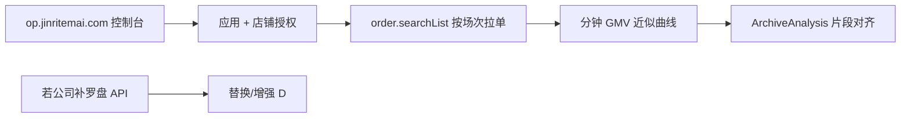

# 抖店开放平台文档中心 — 使用指南

> 文档地址：https://op.jinritemai.com/docs/center  
> 与本地 SDK 对应：`doudian-sdk-python-1.1.0`  
> 网关：`https://openapi-fxg.jinritemai.com/{method_path}`  

---

## 这是什么

| 项目 | 说明 |
|------|------|
| **op.jinritemai.com** | 抖店（巨量引擎电商）**开放平台** — 给 ISV/自研系统接订单、商品、物流等 |
| **抖音罗盘 · 直播大屏** | 抖店商家后台里的**数据分析产品**（网页 UI） |
| **关系** | 开放平台 ≠ 罗盘 UI 的一比一 API；罗盘里很多分钟曲线**不一定**有对应开放接口 |

你桌面上的 Python SDK，就是从这个文档中心 **「SDK 下载」** 生成的代码包。

---

## 文档中心怎么逛

```
https://op.jinritemai.com/docs/center
├── 开发指南     鉴权、签名、授权流程（先看）
├── API 文档     每个接口的 method、参数、示例
├── 消息文档     Webhook 推送（如开播/关播）
├── 平台公告     接口变更
└── 控制台       创建应用、AppKey、申请权限
    https://op.jinritemai.com/console
```

### 调用格式（所有 API 通用）

```http
GET https://openapi-fxg.jinritemai.com/order/searchList
  ?app_key=...
  &method=order.searchList
  &access_token=...
  &param_json={...}
  &timestamp=...
  &v=2
  &sign=...
  &sign_method=hmac-sha256
```

Python SDK 里 `getUrlPath()` 返回的路径（如 `/order/searchList`）+ 公共参数，就是上面的 `method`。

---

## 接入前必做（控制台）

1. **创建应用** → 拿到 `app_key` / `app_secret`
2. **申请 API 权限** → 在 API 文档页点「申请权限」（常见：订单、商品、店铺）
3. **店铺授权** → 金典拍拍店铺 OAuth 授权给你的应用
4. **拿 access_token** → SDK：`AccessTokenBuilder.buildTokenByShopId(shop_id)`

密钥只放本地 config，勿提交 git。

---

## 接「典典直播切片」优先搜这些 API

在 **API 文档** 顶栏搜索框输入关键词：

### P0 — 成交验证（替代罗盘分钟 GMV 的起步方案）

| 文档搜索词 | method | 用途 |
|------------|--------|------|
| 订单列表 | `order.searchList` | 按 `create_time_start/end` 拉一场直播时段订单 |
| 订单详情 | `order.orderDetail` | SKU、支付时间、金额 |

对齐逻辑：开播时间～关播时间 → 拉订单 → 按分钟聚合 → 与逐字稿片段对齐。

### P1 — 主播 / 直播事件

| 文档搜索词 | 类型 | 用途 |
|------------|------|------|
| `queryShopSelfAuthors` | API | 店铺自播达人列表 |
| `kolLiveEvent` | **消息文档** | 开播 START / 关播 END 推送 |

消息文档路径：消息文档 → 精选联盟 → `doudian_alliance_kolLiveEvent`

### P2 — 商品补全

| 搜索词 | method |
|--------|--------|
| 商品列表 | `product.listV2` |
| 商品详情 | `product.detail`（以文档为准） |

### ❌ 文档里通常搜不到（罗盘大屏专有）

- 综合趋势 · **分钟成交金额曲线**
- **讲解** / **投放** / **主播** 事件轨
- 千次观看成交 GPM、投放消耗
- 流量分析 Tab、违规 Tab

这些在 `op.jinritemai.com` 的 API 文档里**一般没有同名接口**。若公司说「给了全部接口」，需要问：**罗盘大屏是否有单独数据包或 ISV 内网网关**。

---

## 在文档中心验证「有没有罗盘接口」

1. 打开 https://op.jinritemai.com/docs/api-docs  
2. 依次搜索：**直播大屏**、**罗盘**、**直播间明细**、**内容分析**、**分钟**、**讲解**  
3. 看 **电商洞察 `ecomInsight`** 模块 — 偏短视频榜单/推荐，**不是**直播大屏趋势  

若全部无结果 → 确认：开放平台负责**经营链路**，罗盘负责**分析展示**，二者部分重叠但不等价。

---

## 和 Python SDK 的对照

| 文档中心 | 本地 SDK |
|----------|----------|
| `order.searchList` | `doudian/api/order_searchList/OrderSearchListRequest.py` |
| `buyin.queryShopSelfAuthors` | `doudian/api/buyin_queryShopSelfAuthors/` |
| 某 API 在 SDK 里没有 | 文档页下载最新 SDK，或手写 HTTP |

当前 SDK **不含**任何 compass/罗盘/直播大屏 method（见 `doudian-sdk-inventory.md`）。

---

## 推荐实施路径



**Phase 1（现在就能做）：** 抖店开放平台 + 订单 API + 本地录播/逐字稿  
**Phase 2（等公司确认）：** 罗盘专用数据接口 → 分钟曲线 + 讲解段  

---

## 平台合规提示（内部工具可忽略部分）

开放平台对**第三方数据平台**有经营指标模糊化要求（GPM、成交金额等不能精确外显）。  
你们是**店铺内部教研系统**，自用分析一般不同于对外 SaaS，但仍建议只在内网/NAS 使用，勿把精确 GMV 对外公开。

---

## 相关文档

- SDK 排查：`doudian-sdk-inventory.md`
- 罗盘目标态：`../../superpowers/plans/2026-07-27-douyin-compass-integration-codex-handoff.md`
