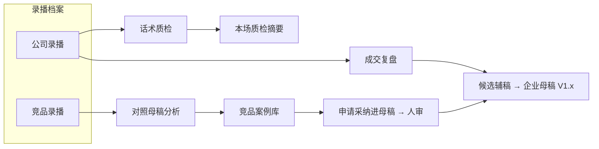
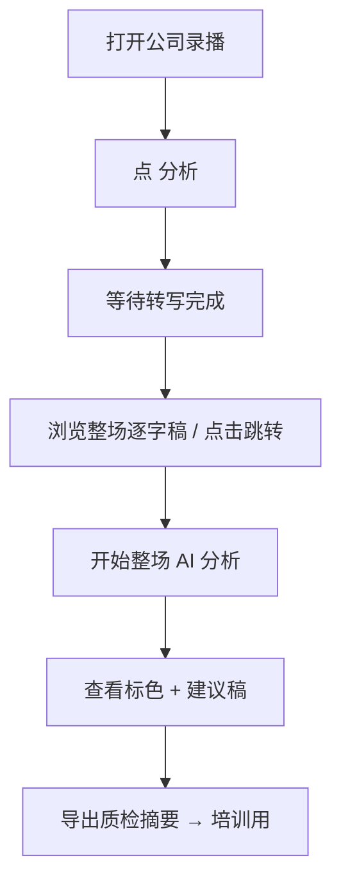
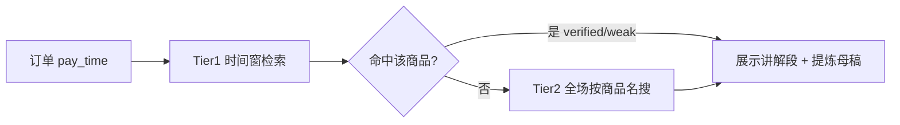
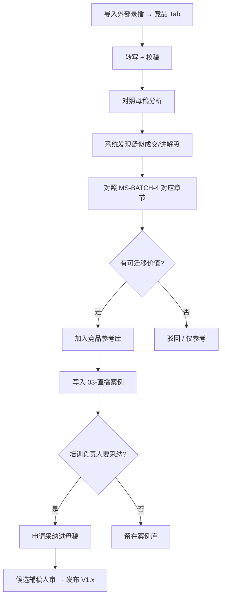
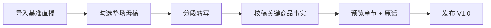

# 直播负责人操作说明

> 适用：**典典直播切片** · 企业母稿 **MS-BATCH-4**  
> 技术实施详见：`docs/superpowers/plans/2026-07-30-dual-path-deal-script-analysis-codex-handoff.md`

---

## 一、先看清两张地图

录播档案从入口就分成两支，**不要混用**：



| 分支 | 你能看到成交数据吗 | 你要干什么 | 结果写到哪里 |
|------|-------------------|------------|--------------|
| **公司录播** | 能（罗盘 + 订单，legacy 模式可用） | **整场 AI 话术质检**（不做成交片段 Tab） | `10-企业母稿` |
| **竞品录播** | **不能** | 用**母稿当尺子**拆竞品话术 | 先 `03-直播案例`，再可选进母稿 |

---

## 二、录播档案列表（长什么样）

### 2.1 顶部 Tab

```
┌─────────────────────────────────────────────────────────────────┐
│  录播档案                                                        │
│  ┌──────────────┐  ┌──────────────┐                             │
│  │ 公司录播 128 │  │ 竞品录播  34 │     🔍 搜索    📅 日期       │
│  └──────────────┘  └──────────────┘                             │
└─────────────────────────────────────────────────────────────────┘
```

### 2.2 公司录播 · 一行档案

```
┌─────────────────────────────────────────────────────────────────┐
│ 📺 7/28 相机专场 · 金典拍拍          时长 04:39                  │
│    ✅ 罗盘已绑定   ✅ 逐字稿已校稿   📈 成交高峰 13:15  ¥236k 51单 │
│                                                                  │
│    [ 回放 ]  [ 成交复盘 ]  [ 话术质检 ]  [ 切片 ]  [ ⋯ ]         │
└─────────────────────────────────────────────────────────────────┘
```

### 2.3 竞品录播 · 一行档案

```
┌─────────────────────────────────────────────────────────────────┐
│ 📺 XX二手相机专场 · 竞品              时长 03:12                  │
│    ⚠ 无订单/罗盘数据   竞品：XX相机店   逐字稿 ✅                 │
│                                                                  │
│    [ 回放 ]  [ 对照母稿分析 ]  [ ⋯ 移到公司录播 ]                 │
└─────────────────────────────────────────────────────────────────┘
```

### 2.4 档案会自动归到哪边？

系统**入库时自动建议**，你可以在列表里 **⋯ → 移到公司/竞品** 手动改。

| 标题/主播里出现… | 默认归到 |
|------------------|----------|
| 金典拍拍、经典拍拍、经典拍拍摄影、金典拍拍摄影 | **公司录播** |
| 外部导入、且不含上面关键词 | **竞品录播** |
| 抖音自有直播间录制 | **公司录播** |

> 分类会写入数据库；改 Tab 后刷新仍保持，不会每次重新猜。

---

## 三、公司录播 · 整场 AI 分析

### 3.1 页面布局

```
┌──────────────────────────┬──────────────────────────────────────────────┐
│  录播视频                 │  AI 分析                                      │
│                          │  整场逐字稿 · 点击句子跳转视频                  │
│  [========播放========]  │                                              │
│                          │  13:12 正常句子…                              │
│                          │  🔴 偏离母稿结构（MiniMax 标色，下一步）         │
│                          │  [开始整场 AI 分析]  [导出质检摘要]             │
└──────────────────────────┴──────────────────────────────────────────────┘
```

**不做：** 成交片段发现、成交话术 Tab、订单切片。订单锚定规则见 §3.2（仅离线脚本 / 未来辅稿，不进当前分析页）。

### 3.2 操作步骤



| 步骤 | 你做什么 | 系统做什么 |
|:----:|----------|------------|
| 1 | 打开 **公司录播** | — |
| 2 | 点 **分析** | 进入两栏页（视频 + AI 分析） |
| 3 | 等转写完成 | **不**自动发现成交片段 |
| 4 | 点击逐字稿句子 | 视频 seek 到对应时刻 |
| 5 | **开始整场 AI 分析** | MiniMax 标四类问题 + [建议稿] |
| 6 | 导出质检摘要 | 给培训用，**不**自动写进母稿 |

### 3.3 订单锚定规则（延后，不进当前分析页）

下单时间可导出，但 **pay_time 和主播讲解时刻可能对不齐**。以下规则供 **离线脚本**（`prepare_master_refinement_candidates.py`）与未来辅稿队列使用，**当前「分析」页不展示**。

下单时间昨天已经能导出了，但 **pay_time 和主播讲解时刻可能对不齐**，所以系统 **不会** 只切「付款前后 90 秒」当话术。

```
每笔订单
  ├─ 第一规则：pay_time → 在「付款前 30 分钟 ~ 付款后 2 分钟」里找讲解
  └─ 兜底规则：若窗内讲错商品 / 只有催单 → 用【订单商品名】搜整场逐字稿，找回真实讲解段
```



| 列表标识 | 含义 |
|:--------:|------|
| ✅ verified | 品牌+型号对上了，可自动进母稿对比 |
| ⚠ weak | 只匹配一部分，要人工看 |
| 🔄 商品兜底 | 时间窗不准，已用商品名在全場找到更合适的段 |

> **付款窗口文本** 只在调试里对照看，**不会**直接当成交话术入库。

### 3.4 没有罗盘/订单时

```
┌─────────────────────────────────────────────────────────────────┐
│ ⚠ 本场未绑定罗盘或订单数据                                       │
│   整场 AI 分析不受影响：仍可对完整逐字稿做质检。                   │
└─────────────────────────────────────────────────────────────────┘
```

---

## 四、公司录播 · 话术质检说明（已合并进 §3 整场分析）

原「话术质检」独立页已合并：公司录播点 **分析** 即进入 **整场 AI 质检**，无「当前片段 / 整场」切换。

### 4.1 标色布局（整场）

```
右栏逐字稿（行内标色）          改进面板（点击句子）
🔴 没报成色就报价              原因：缺验货结论
🟠 价格说了三遍                [建议稿] …
[生成本场质检摘要]
```

### 4.2 四种标色含义

| 颜色 | 含义 | 典型例子 |
|:----:|------|----------|
| 🔴 | 偏离母稿结构 | 没验货就直接报价 |
| 🟠 | 表达不清 / 冗长 | 同一价格重复三遍 |
| 🟡 | 事实风险 | 型号、价格与校稿不一致 |
| 🟣 | 合规 / 过度承诺 | 「永久保修」等不可承诺口径 |

**规则：**

- 改进句一律标 **[建议稿]**，**不是**标准口播稿，不可照着念  
- 「本场质检摘要」给培训用，**不会**自动写进企业母稿  

---

## 五、竞品录播 · 对照母稿分析

竞品没有后台数据，**不能**看成交峰。用 **MS-BATCH-4 十五个章节** 当对照尺。

### 5.1 页面布局

```
┌──────────────┬────────────────────────────┬─────────────────────┐
│ MS-BATCH-4   │   视频 + 逐字稿             │   对照结果           │
│ 15 章导航     │   [高亮：疑似成交段]         │                     │
│              │                            │  对照：08 稀缺催单   │
│ ▶ 08 稀缺催单│                            │  可迁移：表达更好    │
│   04 成色展示│                            │  不可迁移：价格链接  │
│   …          │                            │  [加入竞品参考库]    │
│              │                            │  [申请采纳进母稿]    │
└──────────────┴────────────────────────────┴─────────────────────┘
│ ⚠ 竞品原话不得直接当企业标准稿；须人工审定。                        │
└───────────────────────────────────────────────────────────────────┘
```

### 5.2 操作步骤



| 步骤 | 你做什么 | 写到哪里 |
|:----:|----------|----------|
| 1 | 外部视频导入（自动进竞品 Tab，或手动改） | — |
| 2 | 完成逐字稿校稿 | — |
| 3 | **对照母稿分析** → 选片段 | — |
| 4 | **加入竞品参考库** | Obsidian `03-直播案例` |
| 5 | （可选）**申请采纳进母稿** | 候选辅稿队列 → `10-企业母稿` |

> 竞品 **价格 / 链接 / 库存 / 型号** 只能当参考，进母稿的必须是 **[建议稿]** + 你们自己的口径。

---

## 六、企业母稿 MS-BATCH-4 章节速查

对照分析时，左栏会按这 15 章导航（节选）：

| # | 章节 | 干什么用 |
|---|------|----------|
| 01 | 开场欢迎与福利发放 | 冷启动、发券、关注 |
| 03 | 需求确认与预算探询 | 三问：预算/卡口/用途 |
| 04 | 产品讲解与成色展示 | 验货顺序、成色表述 |
| 06 | 小黄车上链接与价格播报 | 原价—券—到手价 |
| 08 | 稀缺性催单与库存话术 | 在仓/最后一只（须真实） |
| 09–11 | 各类异议处理 | 议价、分期、保修 |
| 12–13 | 售后与发货 | 四件套 + 物流节奏 |
| 14 | 下单备注与赠品锁定 | 备注锁定赠品 |
| 15 | 转场过渡与持续互动 | 多用户承接 |

完整正文见知识库：`10-企业母稿/MS-BATCH-4/V1.0/README.md`

---

## 七、首次建立企业母稿（一次性）

> 与「日常成交复盘」不同，这是 **V1.0 基准** 的建立流程。



| 步骤 | 操作 |
|:----:|------|
| 1 | 导入完整基准直播视频 |
| 2 | 勾选 **「导入后作为整场直播母稿」** |
| 3 | 等待转写；处理系统标出的 **关键商品事实** |
| 4 | 检查商品章节和主播原话预览 |
| 5 | 确认后 **发布 V1.0** |

**本项目首个母稿来源：**

`C:\Users\10230\Downloads\Video\直播大屏·专业版_4.ts`

约 8.8 GB，只需正式导入一次。中断后用 **续跑**，不要重复创建母稿。

---

## 八、候选辅稿 · 结果含义

| 状态 | 含义 | 下一步 |
|------|------|--------|
| ✅ 已进入候选辅稿 | ≥85 分 + 硬门槛通过 | 队列里 **通过 / 退回 / 驳回** |
| 📋 仅保留复盘 | 有参考价值，未达 85 分 | 培训讨论，不进母稿 |
| ⛔ 暂不能进候选辅稿 | 事实/证据/合规问题 | 先校稿或放弃 |
| ❓ 商品待确认 | 无法唯一定位母稿商品 | 先改正逐字稿里的型号 |

**发布新版本：**

```
候选辅稿 [通过]  →  版本差异页 [确认 diff]  →  [发布]  →  V1.0.1 / V1.1 …
```

---

## 九、三条铁律（所有人必记）

```
┌─────────────────────────────────────────────────────────────────┐
│  1. 公司用「成交数据」定位；竞品用「母稿结构」分析。              │
│  2. AI 只给建议；[建议稿] 不是标准口播稿；定稿权在人。            │
│  3. 竞品原话 verbatim 进案例库可以；进企业母稿必须人审 + 改写。   │
└─────────────────────────────────────────────────────────────────┘
```

---

## 十、常见问题

| 问题 | 答案 |
|------|------|
| 标题没写「金典拍拍」但是我们自己的场 | 列表 **⋯ → 移到公司录播** |
| 有成交峰但片段商品对不上 | 正常；峰只定位时段，**verified** 才能入库 |
| 竞品某句话很好，能直接进母稿吗？ | 先 **竞品参考库** → 再 **申请采纳进母稿** → 人审 |
| 话术质检标红会改母稿吗？ | **不会**；只出摘要给培训 |
| 母稿位置要自己选吗？ | **不用**；系统自动匹配章节，商品认不出会提示校稿 |

---

## 十一、相关文档

| 文档 | 用途 |
|------|------|
| `2026-07-30-dual-path-deal-script-analysis-codex-handoff.md` | 开发 PRD（M1–M5） |
| `2026-07-30-deal-segments-master-refinement-codex-handoff.md` | 订单锚定脚本（7/28 专场） |
| `10-企业母稿/MS-BATCH-4/V1.0/` | 当前企业标准正文 |
