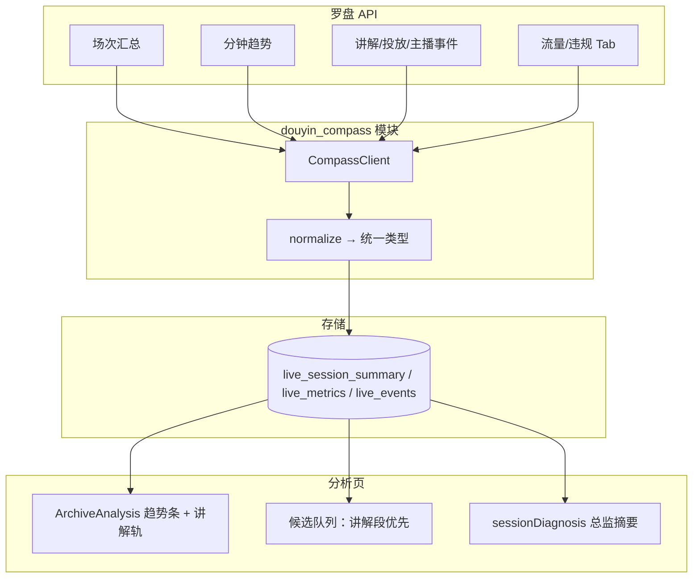

# Codex 任务：抖音罗盘（直播大屏）数据接入

> **来源：** 公司提供抖音罗盘数据接口 + 截图「直播大屏·专业版」  
> **日期：** 2026-07-27  
> **前置：** `2026-07-27-ifupan-module-roadmap-codex-handoff.md`  
> **店铺示例：** 金典拍拍相机专卖店 · 2026-03-27 08:26 · 时长 04:39:26  

---

## 目标

把 **抖音罗盘·直播大屏** 的数据接到「典典直播切片」，复刻罗盘里最有价值的分析能力：

> **「讲解发生在什么时候 → 成交金额是否跟着涨 → 对应逐字稿里说了什么」**

罗盘负责 **结果与运营数据**；本系统负责 **话术证据、母稿对比、人审定稿**。二者在同一时间轴叠加，不做「照着念」导出。

---

## 罗盘大屏 → 本系统映射（按截图）

### 顶部 KPI（场次汇总）

| 罗盘指标 | 本系统用途 |
|----------|------------|
| 直播间成交金额 / 用户支付金额 | 场次诊断 headline、「是否值得深挖」 |
| 千次观看用户支付金额（GPM 类） | 总监摘要效率指标 |
| 投放消耗 | 区分自然流量 vs 付费流量峰值 |
| 平均在线人数 | 背景基线 |
| 观看成交率 / 商品点击成交率 | 优化计划「下场目标」 |
| 成交人数 / 成交件数 | 片段窗内订单验证 |

**存储：** `LiveSessionSummary`（一场一条，挂 `live_id`）

### 综合趋势图（分钟曲线）— **P0 必接**

| 曲线/指标 | 本系统用途 |
|-----------|------------|
| **成交金额** 分钟序列 | 找成交峰；与 AI 发现的片段交叉验证 |
| 在线人数（若同屏有） | 话术讲完流量涨跌 |
| 进场/离场（若有） | 留人/塑品效果 |

**存储：** `LiveMetricsTimeline.points[]`，`offset_ms` 相对罗盘场次开播时刻。

### 底部事件轨 — **P0 必接（罗盘独有优势）**

| 轨道 | 截图表现 | 本系统用途 |
|------|----------|------------|
| **讲解** | 黄点/段 | **自动圈选待分析窗口**：每个讲解段 = 候选「塑品/报价/逼单」区间 |
| **投放** | 浅蓝条 | 标注「峰值是否由投放带来」 |
| **主播** | 紫条（如罗雨欣） | 多主播场次归因、培养包按人拆分 |

**存储：** `LiveEvent[]` `{ type: "explain"|"ad"|"host", start_ms, end_ms, meta? }`

**产品逻辑：** 打开分析页时，若本地尚无 AI 候选，**先用罗盘讲解段生成「待分析队列」**，再跑 12 类发现 — 比全量扫 transcript 更准、更快。

### 右侧互动区

| 数据 | 建议 |
|------|------|
| 评论/弹幕 | 优先用本地 `danmu.txt`；罗盘评论作补全或校验 |
| 录像 | 优先用本地录播；罗盘回放仅作对照 |

### 子 Tab（P1/P2）

| Tab | 用途 |
|-----|------|
| 流量分析 | 场次诊断「流量结构」段落 |
| 主播分析 | 培养包、人效对比 |
| 违规情况 | 合规 gate，不进母稿候选 |

---

## 和本地录播如何对齐（关键）

罗盘场次标识（向公司确认字段名）：

```text
shop_id / 店铺名
live_room_id
compass_live_id 或 live_start_time（如 2026-03-27 08:26:xx）
duration（04:39:26）
```

本地标识：

```text
cache/douyin/{room_id}/{live_id}/
records: platform, room_id, live_id, created_at, length
```

### 对齐三步

1. **绑定场次**：`live_platform_sessions` 存 `compass_live_id` + `compass_started_at`
2. **计算 offset**：`local_offset_ms = local_start - compass_start`（允许 ±30s 手动微调 UI）
3. **统一时间轴**：所有罗盘 `offset_ms` 减去 `local_offset_ms` 后，与 `subtitle.srt` / 片段 `startSec` 对齐

```text
罗盘 10:05 讲解段  →  本地 video 10:04:52（若 offset=-8s）
```

---

## 推荐架构



模块路径建议：`src-tauri/src/douyin_compass/`（与公司网关封装在一起）

---

## 统一类型（Rust / TS 共用概念）

```rust
pub struct CompassSessionSummary {
    pub compass_live_id: String,
    pub shop_name: String,
    pub started_at: String,
    pub duration_sec: u64,
    pub gmv_fen: u64,
    pub pay_user_count: u32,
    pub pay_item_count: u32,
    pub ad_spend_fen: u64,
    pub gpm_fen: u64,
    pub avg_online: u32,
    pub watch_to_pay_rate: f64,
    pub click_to_pay_rate: f64,
}

pub struct CompassMetricsPoint {
    pub offset_ms: u64,
    pub gmv_fen: u64,
    pub online_count: Option<u32>,
}

pub enum CompassEventType { Explain, AdDelivery, Host }

pub struct CompassLiveEvent {
    pub event_type: CompassEventType,
    pub start_ms: u64,
    pub end_ms: u64,
    pub label: Option<String>,  // 商品名 / 主播名
}
```

片段窗口 API：

```rust
fn segment_context(
    summary: &CompassSessionSummary,
    timeline: &[CompassMetricsPoint],
    events: &[CompassLiveEvent],
    start_sec: f64,
    end_sec: f64,
) -> SegmentCompassContext;
// 返回：窗内 GMV、较前 2 分钟 GMV Δ、是否落在讲解段内、是否投放重叠
```

---

## 数据库（SQLite）

```sql
CREATE TABLE compass_live_sessions (
  id INTEGER PRIMARY KEY AUTOINCREMENT,
  platform TEXT NOT NULL DEFAULT 'douyin',
  room_id TEXT NOT NULL,
  live_id TEXT NOT NULL,
  compass_live_id TEXT,
  shop_name TEXT,
  compass_started_at TEXT NOT NULL,
  local_offset_ms INTEGER NOT NULL DEFAULT 0,
  summary_json TEXT,
  synced_at TEXT,
  UNIQUE(platform, room_id, live_id)
);

CREATE TABLE compass_metrics_minute (
  platform TEXT, room_id TEXT, live_id TEXT,
  offset_ms INTEGER NOT NULL,
  gmv_fen INTEGER, online_count INTEGER,
  PRIMARY KEY (platform, room_id, live_id, offset_ms)
);

CREATE TABLE compass_live_events (
  id INTEGER PRIMARY KEY AUTOINCREMENT,
  platform TEXT, room_id TEXT, live_id TEXT,
  event_type TEXT NOT NULL,
  start_ms INTEGER NOT NULL,
  end_ms INTEGER NOT NULL,
  label TEXT
);
```

---

## Config

```rust
pub struct DouyinCompassConfig {
    pub enabled: bool,
    pub api_base_url: String,   // 公司罗盘网关
    pub app_key: String,
    pub app_secret: String,
    pub shop_id: Option<String>,
    pub sync_on_analysis_open: bool,
}
```

Tauri commands：

```text
test_compass_connection
bind_compass_session(platform, roomId, liveId, compassLiveId?, startedAt?)
sync_compass_live_data(platform, roomId, liveId, force?)
get_compass_session_summary(...)
get_compass_timeline(...)
get_compass_events(...)
get_segment_compass_context(..., startMs, endMs)
adjust_compass_time_offset(..., offsetMs)   // 手动微调对齐
```

---

## 与分析流程的结合（产品规则）

### 发现候选片段（新优先级）

```
1. 罗盘「讲解」事件段（有 GMV 峰 nearby 的优先）
2. 罗盘 GMV 分钟峰 ±90s 窗口
3. 现有 LLM 12 类全量发现（兜底）
```

### 片段卡片展示（P0 UI）

```
[成交信号] 讲解段内 · 窗内 GMV ¥2,340 · 较前 2 分钟 +180%
[投放] 重叠投放中
[主播] 罗雨欣
```

### 总监摘要（P0-2）

```
本场 GMV ¥134,107 · GPM ¥11,411 · 成交 23 件
峰值出现在 10:05、12:45，均落在讲解段内
建议优先复盘：10:02–10:08「56 号链接」讲解（GMV 峰 + 逐字稿完整链路）
```

### 母稿评分证据

- 窗内 `gmv_fen > 0` → `confirmed_conversion` 证据加强
- 无成交峰 + 高母稿分 → 标记「内容好但未转化，查流量/品项」

---

## 分阶段实施

### Phase 1（1 周）— 能看趋势、能对讲解

- [ ] CompassClient + config + test_connection
- [ ] sync：summary + minute GMV + explain events
- [ ] 分析页：迷你趋势条 + 片段「成交信号」一行
- [ ] 时间 offset 手动微调

### Phase 2（1 周）— 智能队列 + 总监摘要

- [ ] 讲解段驱动候选队列
- [ ] `sessionDiagnosis` 消费 Compass 数据
- [ ] 投放/主播轨展示

### Phase 3

- [ ] 流量分析 / 违规 Tab 数据
- [ ] 优化计划导出含罗盘 KPI 表
- [ ] 多店铺 config

---

## 向公司要的接口（按罗盘页面列）

| # | 对应罗盘 UI | 需要确认 |
|---|-------------|----------|
| 1 | 顶部 KPI 卡 | 场次详情接口路径 + `compass_live_id` |
| 2 | 综合趋势·成交金额 | 分钟粒度字段名 |
| 3 | 综合趋势·在线（若有） | 是否同一接口 |
| 4 | 讲解轨道 | **事件列表接口**（起止时间、商品 ID/名） |
| 5 | 投放轨道 | 投放起止或分钟消耗 |
| 6 | 主播轨道 | 主播 ID/名 + 上下播时间 |
| 7 | 流量分析 Tab | P2 |
| 8 | 违规情况 Tab | P2 |

样例文件：`docs/integrations/douyin/sample-response/compass-*.json`

---

## 测试

- Mock：`sample-response/` 脱敏 JSON，不连真网
- 验收场次：**2026-03-27 金典拍拍**（截图场次），对照罗盘 10:05 峰与本地 transcript 时间
- 命令：`cargo test douyin_compass`；前端 `liveMetrics.test.ts`

---

## 用户 checklist

1. 确认接口是 **罗盘 OpenAPI / 公司网关** 哪一种
2. 要 **1 场直播** 的：汇总 + 分钟 GMV + 讲解事件 JSON（脱敏）
3. 确认 `compass_live_id` 与 `room_id`、开播时间关系
4. 填 `docs/integrations/douyin/README.md`
5. Codex 实施 Phase 1
6. 用截图场次验收：讲解黄点 ↔ 成交峰 ↔ 逐字稿

---

## 一句话给 Codex

> 实现 `douyin_compass` 模块，拉取罗盘场次汇总、分钟 GMV、讲解/投放/主播事件，与本地 `live_id` 绑定并支持 offset 微调；分析页展示片段成交信号，讲解段优先生成候选队列。
