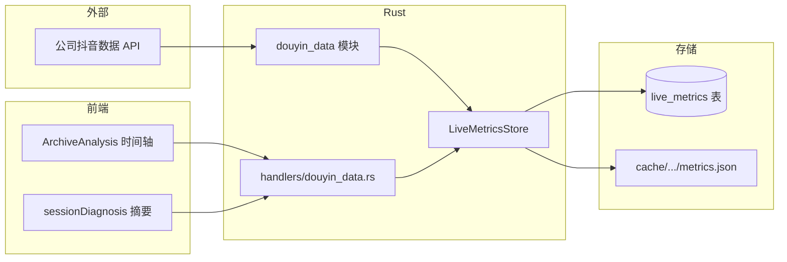

# Codex 任务：抖音数据接口接入 — 与录播分析时间轴对齐

> **来源：** 公司提供全部抖音数据接口 + 产品路线图 P2  
> **日期：** 2026-07-27  
> **前置文档：** `2026-07-27-ifupan-module-roadmap-codex-handoff.md`  

---

## 目标

把公司抖音数据接口接到「典典直播切片」，实现爱复盘式能力：

**「某段话术讲完 → 在线/互动/成交发生了什么」** 与逐字稿、成交片段 **同一时间轴** 展示，并进入总监诊断摘要。

---

## 第一步：向公司要的「接口清单表」（实施前必填）

请产品/数据同事填表（或把 OpenAPI/Swagger PDF 放进 `docs/integrations/douyin/`）：

| 字段 | 说明 | 示例 |
|------|------|------|
| 接口名称 | | 直播间分钟趋势 |
| URL / SDK 方法 | | `GET /live/room/metrics/minute` |
| 鉴权方式 | AppKey+Secret / OAuth / 内网 Token | |
| 频率限制 | QPS、日配额 | |
| **关联键** | 如何对应一场直播 | `room_id` / `aweme_id` / `live_session_id` / 开播时间 |
| 时间粒度 | 秒 / 分钟 / 场次汇总 | |
| 返回字段 | | `online_count`, `gmv`, `pay_order_cnt`, `click_cnt` … |
| 延迟 | 实时 / T+1 | |

### 建议优先接入的 5 类数据（对齐业务）

| 优先级 | 数据类型 | 产品用途 |
|--------|----------|----------|
| P0 | **分钟级在线人数** | 话术↔流量涨跌 |
| P0 | **场次汇总**（观看、成交、GPM） | 总监诊断摘要 headline |
| P1 | **分钟级成交/订单** | 验证「完整成交链路」 |
| P1 | **商品点击/曝光** | 塑品/上链接片段效果 |
| P2 | **用户画像、粉丝来源** | 背景信息，M1-001 样本已用 |

---

## 第二步：和本系统怎么「对齐一场直播」

### 现有本地主键

```text
cache/{platform}/{room_id}/{live_id}/
  ├── danmu.txt          ← 已有，毫秒时间戳
  ├── subtitle.srt       ← 逐字稿
  └── ...
```

数据库 `records` 表：

```text
platform = "douyin"
room_id  = 直播间号（字符串）
live_id  = 本系统场次 ID（录制开始时生成）
created_at = 开播/入库时间
```

### 关联策略（按接口能力选一种）

| 策略 | 条件 | 做法 |
|------|------|------|
| **A. 平台 live_id 直配** | 接口返回抖音官方场次 ID | 录制时写入 `records.extra` 或新表 `live_session.platform_session_id` |
| **B. 时间窗匹配** | 只有 room_id + 开播/关播时间 | `created_at ± 5min` 匹配接口场次列表 |
| **C. 人工绑定** | 历史场次对不上 | 分析页「绑定抖音场次」下拉框，存 SQLite |

**Codex 实施建议：** 新表 + 绑定逻辑，不要改 `live_id` 主键。

---

## 第三步：推荐架构



### 新 crate 或模块

建议：`src-tauri/src/douyin_data/`（不必单独 crate，除非接口很多）

```text
douyin_data/
  mod.rs           # 公开类型 + fetch 入口
  client.rs        # HTTP / SDK 封装，鉴权、重试
  config.rs        # 从 AppConfig 读 endpoint、key（勿提交密钥）
  normalize.rs     # 各接口 JSON → 统一 LiveMetricsTimeline
  types.rs
```

### 统一时间轴类型（核心）

```rust
/// 与录播起点对齐后的指标点；offset_ms 相对本场 live 开始。
pub struct MetricsPoint {
    pub offset_ms: u64,
    pub online_count: Option<u32>,
    pub enter_count: Option<u32>,
    pub leave_count: Option<u32>,
    pub pay_order_count: Option<u32>,
    pub gmv_fen: Option<u64>,        // 分
    pub product_click_count: Option<u32>,
}

pub struct LiveMetricsTimeline {
    pub platform: String,
    pub room_id: String,
    pub live_id: String,             // 本系统
    pub platform_session_id: Option<String>,
    pub live_started_at: String,     // ISO8601
    pub points: Vec<MetricsPoint>,   // 按 offset_ms 排序
    pub fetched_at: String,
}
```

片段窗口查询（给前端 / `transcriptSignals`）：

```rust
fn metrics_for_window(timeline: &LiveMetricsTimeline, start_sec: f64, end_sec: f64) -> MetricsWindowSummary;
// 返回：在线峰值、前后2分钟 Δ、该窗内订单数等
```

---

## 第四步：数据库迁移

```sql
-- 场次绑定
CREATE TABLE live_platform_sessions (
  id INTEGER PRIMARY KEY AUTOINCREMENT,
  platform TEXT NOT NULL,
  room_id TEXT NOT NULL,
  live_id TEXT NOT NULL,
  platform_session_id TEXT,
  live_started_at TEXT,
  live_ended_at TEXT,
  bind_source TEXT NOT NULL,  -- 'auto' | 'manual' | 'import'
  created_at TEXT NOT NULL,
  UNIQUE(platform, room_id, live_id)
);

-- 分钟指标（也可只存 JSON 文件，表做索引）
CREATE TABLE live_metrics_minute (
  id INTEGER PRIMARY KEY AUTOINCREMENT,
  platform TEXT NOT NULL,
  room_id TEXT NOT NULL,
  live_id TEXT NOT NULL,
  offset_ms INTEGER NOT NULL,
  payload_json TEXT NOT NULL,
  UNIQUE(platform, room_id, live_id, offset_ms)
);
```

**为什么这么存：** 查询片段窗口用 `offset_ms` 索引；原始 JSON 保留便于接口字段变更。

---

## 第五步：Config 与密钥

`src-tauri/src/config.rs` 增加（示例）：

```rust
pub struct DouyinDataConfig {
    pub enabled: bool,
    pub base_url: String,           // 公司网关地址
    pub app_key: String,
    pub app_secret: String,         // 或 token
    pub sync_on_live_end: bool,     // 下播后自动拉取
    pub sync_on_analysis_open: bool // 打开分析页时补拉
}
```

- 密钥只进本地 `config.json`，**禁止**提交 git  
- `Setting.svelte` 增加「抖音数据接口」卡片：测试连接、保存  

Tauri commands：

```text
test_douyin_data_connection
bind_live_platform_session(platform, roomId, liveId, platformSessionId?)
sync_live_metrics(platform, roomId, liveId, force?)
get_live_metrics_timeline(platform, roomId, liveId)
get_segment_metrics_summary(platform, roomId, liveId, startMs, endMs)
```

---

## 第六步：和现有代码挂钩

| 现有模块 | 接入方式 |
|----------|----------|
| `recorder_manager.handle_live_end` | 下播后 `spawn sync_live_metrics` |
| `DanmuTimeline` / `danmu.txt` | 指标与弹幕 **同一 offset_ms**；ASR 可继续用 danmu 作 context |
| `ArchiveAnalysis.svelte` | 选中片段时展示 `MetricsStrip`：在线曲线 + Δ |
| `sessionDiagnosis.ts`（P0-2） | `issues` 写入「14:32 讲解 R62 后在线 -18%」 |
| `transcriptSignals.ts`（P2-1） | 文本信号 + 真实订单信号合并 |
| `compare_highlight_to_master` | `confirmed_conversion` 若有该窗 `pay_order_count>0` 则提升证据等级 |

### 前端类型（`src/lib/liveMetrics.ts`）

```typescript
export type MetricsPoint = {
  offsetMs: number;
  onlineCount?: number;
  payOrderCount?: number;
  gmvFen?: number;
};

export type SegmentMetricsSummary = {
  onlineDelta: number | null;
  payOrdersInWindow: number;
  label: string;  // 「讲解后在线上升」「成交窗口内有 2 单」
};
```

---

## 第七步：分阶段实施

### Phase 1 — 能拉、能存、能显示（1 周）

- [ ] `douyin_data/client.rs` + config + `test_connection`
- [ ] 手动/下播后 `sync_live_metrics` → `metrics.json` 或 DB
- [ ] 分析页片段卡片一行 **结果信号**（在线 Δ、订单数）
- [ ] 无数据时显示「未绑定抖音场次 / 点击同步」

### Phase 2 — 自动绑定 + 总监摘要（1 周）

- [ ] 下播自动按时间窗匹配 `platform_session_id`
- [ ] `sessionDiagnosis` 消费 metrics
- [ ] 片段列表按「成交窗内有订单」筛选

### Phase 3 — 诊断深化

- [ ] 分钟曲线迷你图（Canvas/SVG）
- [ ] 导出优化计划含数据截图表
- [ ] 多账号看板（P2-4）

---

## 第八步：实施前你需要提供给 Codex 的材料

放进仓库（可 gitignore 敏感部分）：

```text
docs/integrations/douyin/
  README.md              # 公司接口说明摘要（无密钥）
  openapi.yaml           # 或 postman_collection.json
  field-mapping.md       # 接口字段 → MetricsPoint 映射
  sample-response/       # 脱敏 JSON 样例
```

**没有 OpenAPI 时**，至少提供：

1. 鉴权 curl 示例（密钥打码）  
2. 一场直播的分钟数据 JSON 样例  
3. 场次 ID 在哪个字段  

---

## 测试

```powershell
cargo test douyin_data
npm run test:transcript-review
```

集成测试：用 `sample-response/` 脱敏 JSON mock client，不调用真实 API。

手动验收：

- [ ] 设置页「测试连接」成功  
- [ ] 某场 douyin 录播同步后 `get_live_metrics_timeline` 有数据  
- [ ] 分析页选中片段显示在线/订单摘要  
- [ ] 无密钥时 graceful 降级，不阻塞转写/发现  

---

## 安全与合规

- AppSecret 仅本地 config，日志脱敏  
- 指标数据含 GMV/订单时，导出计划需权限提示  
- 遵守公司数据接口使用范围（内网/VPN）

---

## 给 Codex 的一句话

> 在弄清 `docs/integrations/douyin/` 接口文档后，实现 douyin_data 模块：config → client → LiveMetricsTimeline → sync/get API → ArchiveAnalysis 片段指标条；Phase 1 优先分钟在线与订单窗汇总。

---

## 用户侧「我现在该怎么做」 checklist

1. **向公司要**：OpenAPI/Postman + 鉴权说明 + 1 份脱敏样例 JSON  
2. **填接口清单表**（本文第二节表格）  
3. **确认关联键**：接口里的场次 ID 能否和 `room_id` + 开播时间对应  
4. **把文档放进** `docs/integrations/douyin/`  
5. **把本文 + 样例交给 Codex** 实施 Phase 1  
6. **你验收**：选一场已知 GMV 的直播，看片段窗内订单是否对得上  
