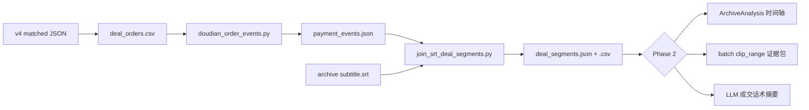

# Codex 任务：订单锚定成交片段 — 7/28 金典拍拍相机专场

> **背景：** 用户已用 `doudian_reconcile_leaderboard.py` v4 将罗盘 **51 件 / 46 人 / ¥236,552** 与抖店订单对齐（`orders-leaderboard-reconcile-v4.json`，49 单）。  
> **目标：** 用订单 CSV + 7/28 **08:15–15:44** 录播视频 + 逐字稿，切出「下单时刻前后主播说了什么」的**成交话术片段**，供复盘/培训。  
> **样本场次：** 金典拍拍相机专卖店 · `shop_id=212709966` · `started_at=2026-07-28 08:15:49` · `main_room_id=7667365600607357706`  
> **Cursor 职责：** 只审 diff  
> **Codex 职责：** 按本文实施、跑脚本、补测试、提交  

---

## 产品定义（必须先理解）

| 概念 | 定义 |
|------|------|
| **成交锚点** | 一笔已匹配订单的 `pay_time`（SKU 级优先，否则订单级） |
| **视频偏移** | `offset_sec = pay_time_unix - live_started_at_unix` |
| **成交话术窗** | 锚点**之前**主播促单/报价/上链接的语音，默认 `[offset_sec - 90, offset_sec - 5]` |
| **确认话术窗** | 锚点**之后**短确认，默认 `[offset_sec - 5, offset_sec + 30]` |
| **切片窗** | 导出视频证据，默认 `[offset_sec - 120, offset_sec + 30]`，clamp 到 `[0, video_duration]` |

**公司约束（与 `2026-07-27-deal-segment-analysis-codex-handoff.md` 一致）：**

- AI 产出 = **参考改写 / 培训讨论点**，不是「可直接照着念的标准稿」
- 优先用 **`transcript.corrected.srt`**；无则 fallback `subtitle.srt`
- 订单证据 = **客观锚点**；话术质量仍走现有 `compareHighlightToMaster` 人工 gate

---

## 已有资产（不要重复造轮子）

### 数据文件（用户 Desktop，不入库）

| 文件 | 用途 |
|------|------|
| `d:\Desktop\orders-leaderboard-reconcile-v4.json` | **49 单** matched_order_ids + by_product |
| `d:\Desktop\order-searchList-20260728-0815-1544-20260729-161739.json` | 订单 SKU 明细、pay_time、buyer |
| `c:\Users\10230\Downloads\直播间详情页_金典拍拍相机专卖店_2026-07-28_08-15-49_整场数据下载 (2).xlsx` | started_at / GMV / 商品榜 |

### 已有脚本

| 脚本 | 用途 |
|------|------|
| `scripts/doudian_order_events.py` | `pay_time → offset_sec` 事件 JSON |
| `scripts/doudian_reconcile_leaderboard.py` | v4 榜单匹配（已完成） |
| `scripts/doudian_order_utils.py` | `pick_pay_time`, `fmt_local`, `load_orders` |

### 已有 App 能力（Phase 2 接入）

| 模块 | 用途 |
|------|------|
| `src/page/ArchiveAnalysis.svelte` | SRT 解析、seek、候选发现 |
| `src/lib/transcriptSignals.ts` | 窗口内问价/链接/成交确认 keyword |
| `src/lib/archiveAnalysis.ts` | 候选类型、`discoverCandidates` |
| `src-tauri/.../recorder_manager.rs` | `clip_range` 按秒切视频 |
| `live_dashboard_bindings` | 录播 ↔ 罗盘场次 `started_at` |

### 当前缺口

- 无「订单 CSV → SRT join → 成交片段 JSON/CSV」脚本
- ArchiveAnalysis **无** pay_time 时间轴
- 无 order-triggered `clip_range` 批量导出

---

## 端到端流程（推荐分两期）



---

## Phase 1（P0）：Python 离线管线 — Codex 本期必做

### Task 1: 从 v4 导出成交订单 CSV

**新增：** `scripts/doudian_export_deal_orders_csv.py`

**输入：**

- `--reconcile` → `orders-leaderboard-reconcile-v4.json`
- `--source-orders` → `order-searchList-20260728-0815-1544-20260729-161739.json`

**输出 CSV 列：**

```
order_id, pay_time_local, pay_time_unix, pay_amount_yuan, order_status,
buyer_id, product_name, leaderboard_product, sku_index, room_id
```

**规则：**

- 只导出 `matched_order_ids` 中的 49 单
- 多 SKU 订单：每个**匹配到榜单的 SKU 一行**（读 reconcile 里 per-line 信息；若 v4 JSON 无 line 明细，从 source JSON 的 `sku_order_list` + `by_product.order_ids` 反查 product_name）
- `buyer_id` = `doudian_open_id`（fallback `open_id`）

**命令：**

```powershell
python scripts/doudian_export_deal_orders_csv.py `
  --reconcile "d:\Desktop\orders-leaderboard-reconcile-v4.json" `
  --source-orders "d:\Desktop\order-searchList-20260728-0815-1544-20260729-161739.json" `
  --output "d:\Desktop\deal-orders-20260728-v4.csv"
```

**验收：** 51 行 SKU（或 49 行若按订单粒度 — **必须 51 行 SKU** 与件数一致）

---

### Task 2: 生成 payment_events（带 offset_sec）

**复用：** `scripts/doudian_order_events.py`（可小改：支持 `--order-ids-file` 只保留 matched 单）

**参数：**

```powershell
python scripts/doudian_order_events.py `
  --orders "d:\Desktop\order-searchList-20260728-0815-1544-20260729-161739.json" `
  --started-at "2026-07-28 08:15:49" `
  --shop-id 212709966 `
  --pay-time-start "2026/07/28 08:15:00" `
  --pay-time-end "2026/07/28 15:44:39" `
  --output "d:\Desktop\payment-events-20260728-v4.json"
```

**后处理过滤：** 只保留 `order_id ∈ matched_order_ids`（脚本内或 `--order-ids-file`）

**验收：**

- `event_count` = 51（SKU 级）或明确文档说明订单级 vs SKU 级
- 首单 `offset_sec >= 0`，末单 `offset_sec <= 7*3600+29*60`（约 7h29m）

---

### Task 3: SRT × 订单 join → 成交片段

**新增：** `scripts/join_srt_deal_segments.py`

**输入：**

- `--events` → `payment-events-20260728-v4.json`
- `--srt` → 录播目录下 `transcript.corrected.srt` 或 `subtitle.srt`
- `--pre-sec` 默认 `90`（成交话术窗起点 = offset - 90）
- `--post-sec` 默认 `30`（确认窗终点 = offset + 30）
- `--clip-pre-sec` 默认 `120`
- `--clip-post-sec` 默认 `30`

**核心逻辑：**

```python
def cues_in_window(cues, start_sec, end_sec) -> list[Cue]:
    return [c for c in cues if c.end >= start_sec and c.start <= end_sec]

for event in events:
    t = event["offset_sec"]
    pitch = cues_in_window(cues, t - pre_sec, t - 5)      # 成交话术
    confirm = cues_in_window(cues, t - 5, t + post_sec)   # 下单确认
    clip = (max(0, t - clip_pre_sec), t + clip_post_sec)
```

**输出 `deal_segments.json`：**

```json
{
  "summary": {
    "live_started_at": "2026-07-28 08:15:49",
    "segment_count": 51,
    "srt_path": "...",
    "windows": { "pitch_pre_sec": 90, "pitch_post_sec": 5, "confirm_post_sec": 30 }
  },
  "segments": [{
    "order_id": "...",
    "product_name": "...",
    "pay_time_local": "...",
    "offset_sec": 1234,
    "offset_hms": "20:34",
    "pay_amount_yuan": 9219.0,
    "clip_start_sec": 1114,
    "clip_end_sec": 1264,
    "pitch_start_sec": 1144,
    "pitch_end_sec": 1229,
    "pitch_text": "……拼接的成交话术逐字稿……",
    "confirm_text": "……",
    "pitch_cue_count": 12,
    "signals": { "inquiryCount": 1, "linkCount": 2, "conversionConfirmationCount": 1 }
  }]
}
```

**同步导出 `deal_segments.csv`：**

```
order_id, product_name, pay_time_local, offset_hms, pay_amount_yuan,
clip_start_hms, clip_end_hms, pitch_text, confirm_text, signals_label
```

**SRT 解析：** 复用 `master-ingest` 的 `parse_srt_cues` 逻辑，或复制 `ArchiveAnalysis.svelte` 的 `parseSrt` 规则（`start/end` 为秒 float）

**signals：** 可选调用 TS 逻辑 — Phase 1 在 Python 里复制 `transcriptSignals.ts` 的 keyword 计数即可

**命令：**

```powershell
python scripts/join_srt_deal_segments.py `
  --events "d:\Desktop\payment-events-20260728-v4.json" `
  --srt "D:\path\to\archive\transcript.corrected.srt" `
  --output "d:\Desktop\deal-segments-20260728-v4.json" `
  --csv "d:\Desktop\deal-segments-20260728-v4.csv"
```

**验收：**

- 51 segments，每条 `pitch_text` 非空率 > 90%（无字幕/ASR 缺失的单独标记 `srt_missing: true`）
- 随机抽 3 单人工听：offset 附近确实是该商品讲解

---

### Task 4: 批量切证据视频（可选 P1）

**新增：** `scripts/batch_clip_deal_segments.ps1` 或 Python 调 Tauri HTTP `/api/clip_range`

对 `deal_segments.json` 每条：

```json
{ "ranges": [{ "start": clip_start_sec, "end": clip_end_sec }],
  "title": "{product_name} @ {offset_hms}",
  "note": "order_id={order_id}" }
```

**输出目录：** `d:\Desktop\deal-clips-20260728\{order_id}_{offset_hms}.mp4`

若 CLI 调 app 太重，Phase 1 可只输出 **ffmpeg concat 脚本** 供用户手动跑。

---

### Task 5: 单元测试

**新增：** `scripts/test_join_srt_deal_segments.py`

- 固定 3 条 mock SRT cues + 1 个 event → 断言 `pitch_text` 拼接、`clip_start/end` clamp
- mock `offset_sec=100, pre=90` → pitch 窗 `[10, 95]`

```powershell
python -m pytest scripts/test_join_srt_deal_segments.py -q
```

---

## Phase 2（P1–P2）：App 内集成 — 可拆下一 PR

### Task 6: 导入 payment events 到录播

**DB 表（建议）：** `payment_events`

```sql
id, live_id, order_id, pay_time_unix, offset_sec,
product_name, pay_amount_yuan, buyer_id, source TEXT
```

**Tauri command：** `import_payment_events(live_id, json_path)`

### Task 7: ArchiveAnalysis 订单时间轴

- 在播放器进度条上叠加 49 个 pay 标记（Tooltip：商品名 + 金额）
- 点击标记 → seek 到 `offset_sec - 30`，右栏展示 `pitch_text` + `signals`
- 按钮「以此订单为锚点发现话术」→ 预填 candidate `[pitch_start, pitch_end]`

### Task 8: 与现有发现流程衔接

**不要**替换 `discoverCandidates`（transcript-only LLM 发现仍保留）

**新增模式：** `discoverySource: "order_evidence" | "transcript_llm"`

- order_evidence：直接从 Task 3 JSON 加载 segments 为候选列表
- 每条候选 type = `订单锚定成交话术`
- 仍走 `compareHighlightToMaster`，UI 提示「订单锚点，非 LLM 推测」

### Task 9: started_at 自动解析

优先级：

1. `live_dashboard_bindings` → `live_dashboard_sessions.started_at`
2. 录播 `live_id`（Unix 秒，仅当与罗盘 08:15:49 差 < 120s）
3. 手动输入 / XLSX 导入

**clock skew：** 若切片整体偏前/偏后，支持 archive `local_offset` 加减到所有 `offset_sec`

---

## 时间对齐注意事项（写进 README / 脚本注释）

| 问题 | 处理 |
|------|------|
| `pay_time` vs `create_time` | **成交锚点用 pay_time**；create_time 仅 debug |
| 已关闭仍付款单 | v4 已含 status=4，片段仍有效（罗盘归因） |
| 多 SKU 同单 | 每 SKU 独立锚点；pitch 窗可能重叠 → CSV 标记 `overlap_group` |
| 视频起点 ≠ started_at | 用 binding 的 `started_at`，不是 pay_time 窗口起点 |
| 逐字稿滞后 | ASR 可能有 1–3s 偏差；pitch 窗默认 90s 已留余量 |

---

## Codex 实施顺序

1. Task 1 CSV 导出  
2. Task 2 events（加 order-id 过滤）  
3. Task 3 SRT join（核心）  
4. Task 5 测试  
5. Task 4 批量切片（时间允许）  
6. Phase 2 Task 6–9 另开 PR  

---

## 给用户的一键跑通（Phase 1 完成后）

```powershell
cd d:\git_work\bili-shadowreplay-worktrees\obsidian-vault-read-sync

# 1) 成交订单 CSV
python scripts/doudian_export_deal_orders_csv.py `
  --reconcile "d:\Desktop\orders-leaderboard-reconcile-v4.json" `
  --source-orders "d:\Desktop\order-searchList-20260728-0815-1544-20260729-161739.json" `
  --output "d:\Desktop\deal-orders-20260728-v4.csv"

# 2) 付款事件 + 视频偏移
python scripts/doudian_order_events.py `
  --orders "d:\Desktop\order-searchList-20260728-0815-1544-20260729-161739.json" `
  --started-at "2026-07-28 08:15:49" `
  --shop-id 212709966 `
  --order-ids-file "d:\Desktop\orders-leaderboard-reconcile-v4.json" `
  --output "d:\Desktop\payment-events-20260728-v4.json"

# 3) 成交话术片段（替换 --srt 为实际录播路径）
python scripts/join_srt_deal_segments.py `
  --events "d:\Desktop\payment-events-20260728-v4.json" `
  --srt "D:\录播\20260728-0815\transcript.corrected.srt" `
  --output "d:\Desktop\deal-segments-20260728-v4.json" `
  --csv "d:\Desktop\deal-segments-20260728-v4.csv"
```

---

## 验收清单

- [ ] `deal-orders-20260728-v4.csv` 有 **51 行** SKU，49 个 distinct order_id，46 个 distinct buyer_id  
- [ ] `payment-events-20260728-v4.json` 每条含 `offset_sec` / `offset_hms`  
- [ ] `deal-segments-20260728-v4.csv` 每行有 `pitch_text`，offset 落在 08:15–15:44 内  
- [ ] 总 GMV ≈ ¥236,543（允许 ¥10 内误差）  
- [ ] 测试通过  
- [ ] Phase 2 不阻塞 Phase 1 交付  

---

## 给 Codex 的 Prompt 摘要（可直接粘贴）

```
Implement Phase 1 of docs/superpowers/plans/2026-07-29-order-evidence-deal-segments-codex-handoff.md

Context: 7/28 金典拍拍相机 live, 49 matched orders / 51 SKU items / 46 unique buyers.
Input files on d:\Desktop (reconcile v4 JSON, order searchList JSON).
Output: deal_orders.csv, payment_events.json, deal_segments.json+csv by joining SRT.

Key formula: offset_sec = pay_time_unix - live_started_at_unix (2026-07-28 08:15:49).
Pitch window: [offset-90s, offset-5s]. Reuse doudian_order_utils and existing SRT parsing patterns.

Do NOT implement Phase 2 app UI in this PR unless time permits Task 4 batch clip script.
Follow company rule: output is training reference, not verbatim script to read aloud.
```
