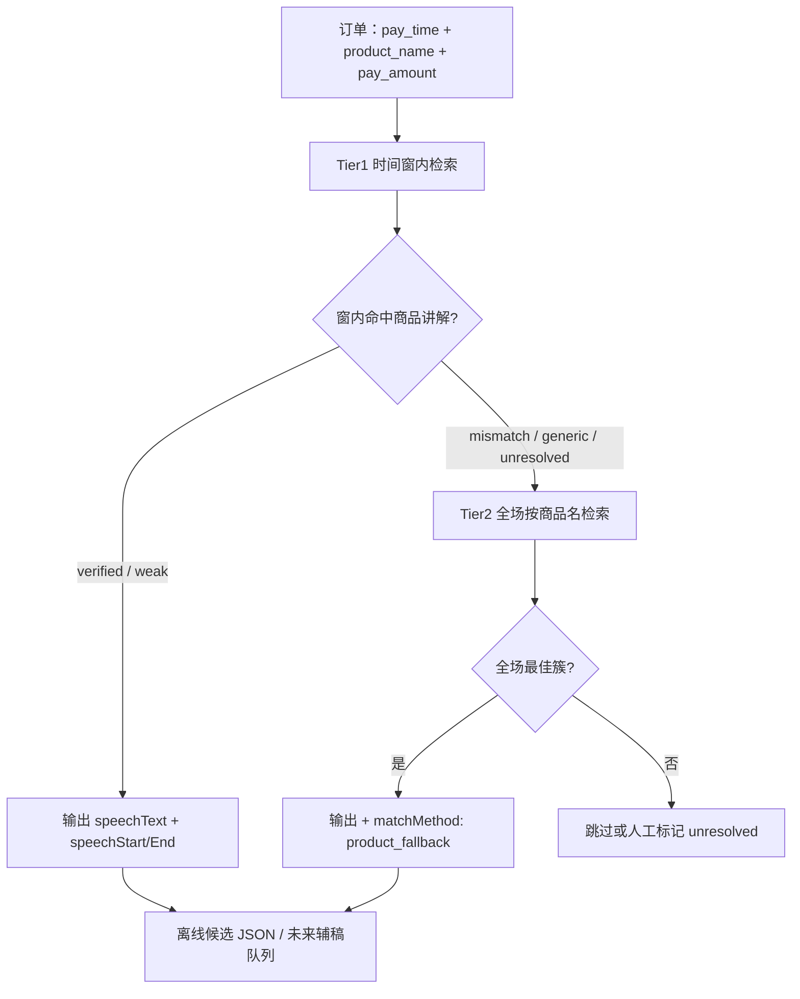

# Codex 任务：录播档案二分 + 双分析页 PRD

> **日期：** 2026-07-30  
> **分支：** `obsidian-vault-read-sync`  
> **Cursor 职责：** 只审 diff，不改代码  
> **Codex 职责：** 按本文 M1→M5 实施、跑测试、提交  
> **关联文档：**  
> - `2026-07-30-deal-segments-master-refinement-codex-handoff.md`（公司录播订单锚定脚本）  
> - `docs/master-script-operator-guide.md`（母稿发布 SOP）

---

## 0. 产品一句话

> **录播档案分为「公司录播」与「竞品录播」。公司录播点「分析」进入整场 AI 话术质检（左视频 + 右逐字稿/标色）；不做成交片段发现、不做「成交话术」Tab。竞品录播以 MS-BATCH-4 企业母稿为对照尺提取可迁移结构，经人工审定后写入案例库，并可显式「申请采纳进母稿」。**

---

## 1. 信息架构（导航）

### 1.1 侧边栏

```
录播档案                    ← 原「录播」改名（App.svelte active key 可保留 "录播" 兼容）
├── 公司录播（默认 Tab）     ← Archive.svelte
└── 竞品录播

录播分析                    ← 由档案类型决定进入哪种子页，不在此让用户再选
├── 公司 · 整场 AI 分析     ← CompanyAnalysisWorkspace（analysisMode: company_deal）
└── 竞品 · 对照母稿         ← CompetitorBenchmark（从 ArchiveAnalysis 分支）
```

**规则：** 用户在 **档案列表** 点「成交复盘 / 话术质检 / 对照母稿分析」时，`archiveKind` 已确定，分析页 **不再** 提供「切换公司/竞品」下拉。

### 1.2 列表页主 CTA 差异

| 档案类型 | 列表行主按钮 | 次要按钮 |
|----------|--------------|----------|
| 公司录播 | **分析**（整场 AI 质检） | 回放、切片 |
| 竞品录播 | **对照母稿分析** | 回放、移到公司录播 |

---

## 2. 数据模型

### 2.1 `archiveKind`（核心字段）

**存储（优先方案）：** `records` 表新增列，或 `records.metadata` JSON（若已有 metadata 列则用 JSON；否则 migration 加列）。

```typescript
type ArchiveKind = "company" | "competitor";

type ArchiveProfile = {
  archiveKind: ArchiveKind;
  archiveKindSource: "auto" | "manual";   // 自动规则 or 用户改过
  competitorName?: string;                // 竞品录播必填（展示用）
  masterScriptKey: string;                // 默认 "MS-BATCH-4"
};
```

**Rust / DB migration 示例：**

```sql
ALTER TABLE records ADD COLUMN archive_kind TEXT NOT NULL DEFAULT 'company'
  CHECK(archive_kind IN ('company', 'competitor'));
ALTER TABLE records ADD COLUMN archive_profile_json TEXT NOT NULL DEFAULT '{}';
```

**前端：** `src/lib/archiveProfile.ts` — `parseArchiveProfile`, `suggestArchiveKind`, `formatArchiveKindLabel`

### 2.2 自动分类规则（默认建议，可覆盖）

```typescript
const COMPANY_NAME_PATTERNS = [
  /金典拍拍/,
  /经典拍拍/,
  /经典拍拍摄影/,
  /金典拍拍摄影/,
];

function suggestArchiveKind(input: {
  title: string;
  anchorName: string;
  roomId: string;
  platform: string;
}): ArchiveKind {
  const haystack = `${input.title} ${input.anchorName} ${input.roomId}`;
  if (COMPANY_NAME_PATTERNS.some((re) => re.test(haystack))) {
    return "company";
  }
  // 外部导入且不含公司关键词 → 竞品
  if (input.platform === "imported" || input.roomId === "bsr:import") {
    return "competitor";
  }
  // 抖音自有直播间录制 → 公司（可按 room_id 白名单扩展）
  return "company";
}
```

**入库时：**

1. 计算 `suggestArchiveKind`  
2. 写入 `archiveKind` + `archiveKindSource: "auto"`  
3. 列表提供 **「移到竞品录播 / 移到公司录播」** 菜单项 → `archiveKindSource: "manual"`

**禁止：** 仅靠运行时读 title 字符串分流、不落库。

### 2.3 公司录播 · 数据绑定状态（展示用，非新表必填）

```typescript
type CompanyArchiveSignals = {
  compassBound: boolean;      // liveDashboard 已绑定
  paymentEventsLoaded: boolean;
  peakDealMinute: string | null;
  orderCount: number | null;
  gmvTotal: number | null;
  transcriptReviewed: boolean;
};
```

无罗盘/订单时：成交复盘页顶栏 **黄色降级条**（见 §4.2）。

### 2.4 话术质检标注类型

```typescript
type ScriptIssueKind =
  | "master_structure_gap"   // 🔴 偏离母稿结构
  | "unclear_expression"     // 🟠 表达不清/冗长
  | "factual_risk"           // 🟡 事实风险（型号/价格/校稿）
  | "compliance_risk";       // 🟣 合规/过度承诺

type ScriptIssueAnnotation = {
  cueId: number;
  startMs: number;
  endMs: number;
  kind: ScriptIssueKind;
  originalText: string;       // 主播原话 verbatim
  reason: string;
  suggestion: string;         // 必须以 [建议稿] 开头
  masterSectionTitle?: string;
};
```

### 2.5 竞品参考候选（与 enterprise support_candidates 分离）

```typescript
type CompetitorReferenceCandidate = {
  id: number;
  sourceKey: string;
  competitorName: string;
  masterScriptKey: string;
  masterSectionId: number;
  masterSectionTitle: string;
  hostText: string;
  comparisonJson: string;
  migrationDecision:
    | "migratable_structure"
    | "better_phrasing"
    | "reference_only"
    | "not_applicable";
  totalScore: number;
  status: "pending" | "approved_reference" | "rejected" | "adopt_requested";
};
```

`adopt_requested` → 人工触发「申请采纳进母稿」→ 创建 enterprise `support_candidate`（带 `sourceKind: competitor_adoption` 标记）。

### 2.6 成交话术定位：时间优先 + 商品名兜底（**延后**，不进公司分析 UI）

> **2026-07-30 产品决策：** 公司录播「分析」页 **只做整场 AI 质检**，不展示成交片段 Tab、不自动 `discoverCandidates`、不展示订单时间轴。  
> 本节规则保留给 **离线脚本**（`prepare_master_refinement_candidates.py`）与未来「订单锚定辅稿」工作流，**不在当前 App 公司分析页实现**。

> **背景：** 昨日已生成下单时间点（`payment-events` / `deal-segments`），但 **pay_time 与 ASR 讲解时刻存在漂移**，不能直接把「付款前 90 秒窗口文本」当成交话术。  
> **产品规则：** **时间 = 第一锚点；订单商品名 = 兜底检索键**，在整场 SRT 里找回真实讲解段。

#### 匹配流程（两级）



| 层级 | 触发 | 搜索范围 | 排序依据 |
|------|------|----------|----------|
| **Tier 1（主规则）** | 每笔订单 `pay_time` → `offset_sec` | pay 前 **30min** ~ pay 后 **2min**（与脚本默认一致，可配置） | 商品 token 命中 + 品牌一致 + 价格接近 + **距 pay_time 越近越高** |
| **Tier 2（兜底）** | Tier1 为 `mismatch` / `generic` / `unresolved`，或窗内最高分 &lt; 阈值 | **整场 SRT** | **商品名/型号命中优先**；同分取离 pay_time 最近且 prefer `pre_pay` |

**禁止：** 列表展示或入库时仅使用 `paymentWindowText`（付款窗口拼接文本），该字段只作 debug 对照。

#### 商品名解析（订单 SKU → 检索 token）

复用 `scripts/prepare_master_refinement_candidates.py`：

- `product_tokens()` — 去停用词（99新、镜头、相机…）  
- `BRAND_ALIASES` — 佳能/索尼/尼康…  
- 可选：`pay_amount_yuan` 与逐字稿数字 ±80 元加分  

**UI 展示订单商品名时：** 同时显示「检索用简称」（如订单长标题 → `小白兔` / `R6 II`）。

#### 核验等级（写入 UI 与入库 gate）

| tier | 含义 | 当前 App UI | 自动进母稿对比 |
|------|------|-------------|----------------|
| `verified` | 品牌+型号+(价格或链接) | ✅ 默认选中 | ✅ |
| `weak` | 仅品牌或仅型号 | ✅ 展示，黄标 | ❌ 人工 |
| `mismatch` | 窗内讲别的品牌 | ⚠ 触发 Tier2 | ❌ |
| `generic` | 只有催单无商品 | ⚠ 触发 Tier2 或跳过 | ❌ |
| `unresolved` | 全场搜不到 | 灰显，人工 | ❌ |

#### 输出字段（App / JSON 统一）

```typescript
type DealSpeechMatch = {
  orderId: string;
  productName: string;           // 订单商品名
  payTimeLocal: string;
  payOffsetSec: number;
  matchMethod: "time_window" | "product_fallback" | "manual";
  verificationTier: "verified" | "weak" | "mismatch" | "generic" | "unresolved";
  speechStartSec: number;
  speechEndSec: number;
  speechText: string;            // 真实讲解段（母稿对比 / LLM 提炼用）
  paymentWindowText: string;     // 仅 debug，UI 默认折叠
  timingRelation: "pre_pay" | "post_pay";
};
```

#### Codex 实现任务（衔接已有脚本）

| Task | 文件 | 说明 |
|------|------|------|
| M2.0a | `prepare_master_refinement_candidates.py` | 新增 `search_product_speech_full_session()`；Tier1 失败时走 Tier2 |
| M2.0b | 同上 | 输出 `matchMethod`；mismatch 不再直接 `continue`，先尝试兜底 |
| M2.0c | `DealTimelinePanel`（legacy 模式） | 订单行展示：商品名 + tier 色标；**公司分析页不展示** |
| M2.0d | Rust（可选） | `resolve_deal_speech_match(order, transcript)` 与 Python 规则一致，供 App 内实时重算 |

**验收（7/28 专场）：**

- Ricoh GR 订单：Tier1 窗内 D850 → `mismatch` → Tier2 找到 GR 讲解段或 `unresolved`  
- 小白兔 verified：speechText 含「小白兔/RF70-200」类 token，非仅「恭喜下单」  
- UI 点击订单行 → seek 到 `speechStartSec`，不是 `payOffsetSec`

---

## 3. UI 线框（ASCII）

### 3.1 录播档案列表 — 公司录播 Tab

```
┌──────────────────────────────────────────────────────────────────────────┐
│ 录播档案    [ 公司录播 (128) ]  [ 竞品录播 (34) ]     🔍 搜索  📅 筛选   │
├──────────────────────────────────────────────────────────────────────────┤
│ 📺 7/28 相机专场 · 金典拍拍          04:39   ¥236,552   51单             │
│    罗盘已绑定 ✓  逐字稿已校稿 ✓  成交高峰 13:15                          │
│    [回放]  [分析]  [切片]  [⋯ 移到竞品]                                  │
├──────────────────────────────────────────────────────────────────────────┤
│ 📺 3/27 入门场 · 经典拍拍摄影        02:10   罗盘未绑定                   │
│    逐字稿就绪   ⚠ 无订单数据，成交复盘将降级为语言信号模式                │
│    [回放]  [分析]  [绑定罗盘]                                            │
└──────────────────────────────────────────────────────────────────────────┘
```

### 3.2 录播档案列表 — 竞品录播 Tab

```
┌──────────────────────────────────────────────────────────────────────────┐
│ 📺 XX二手相机专场 · 竞品              03:12   无订单/罗盘数据               │
│    竞品名称：XX相机二手店   逐字稿就绪 ✓   未对照母稿                      │
│    [回放]  [对照母稿分析]  [⋯ 移到公司录播]                               │
└──────────────────────────────────────────────────────────────────────────┘
```

### 3.3 公司录播 · 整场 AI 分析页（两栏）

```
┌──────────────────────────┬──────────────────────────────────────────────┐
│ 录播视频                  │ AI 分析                                       │
│                          │ 整场逐字稿 · 点击句子跳转视频                    │
│ [============播放========]│                                              │
│                          │ 13:12 正常句子…                               │
│                          │ 🔴 没报成色就报价（下一步：MiniMax 标色）        │
│                          │ 13:15 正常句子…                               │
│                          │ [开始整场 AI 分析]  [导出质检摘要]              │
└──────────────────────────┴──────────────────────────────────────────────┘
```

**不做：** 成交片段发现、`discoverCandidates`、成交话术 Tab、订单时间轴（公司分析模式下隐藏）。

**组件：**

- `CompanyAnalysisWorkspace.svelte` — 两栏壳  
- `AiScriptReviewPanel.svelte` — 右栏整场逐字稿 + 质检图例  
- 复用 ArchiveAnalysis 播放器 / 转写逻辑

### 3.4 公司录播 · 话术质检页（三栏）

```
┌─────────────┬──────────────────────────────┬─────────────────────────────┐
│ 质检范围     │ 逐字稿（行内标红）             │ 改进面板                     │
│ ○ 当前片段   │ 正常...                       │ 选中：🔴 偏离母稿结构         │
│ ● 整场       │ 🔴 没报成色就报价              │ 原因：缺验货结论              │
│ 对照母稿章： │ 🟠 价格重复三遍                │ [建议稿] 先报99新依据再报价   │
│ 第4章 成色   │ 正常...                       │ 培训讨论点：...               │
│             │                              │ [生成本场质检摘要]            │
└─────────────┴──────────────────────────────┴─────────────────────────────┘
```

### 3.5 竞品录播 · 对照母稿分析页（三栏）

```
┌─────────────┬──────────────────────────────┬─────────────────────────────┐
│ MS-BATCH-4  │ 视频 + 逐字稿                 │ 对照结果                     │
│ 15章导航     │ [高亮候选段]                  │ 对照章：08 稀缺性催单         │
│ 08 稀缺催单 │                              │ 可迁移：表达更好              │
│ 04 成色展示 │                              │ 不可迁移：价格/链接/库存      │
│ ...         │                              │ [加入竞品参考库]              │
│             │                              │ [申请采纳进母稿]              │
├─────────────┴──────────────────────────────┴─────────────────────────────┤
│ ⚠ 竞品录播无成交数据。竞品原话不得直接作为企业标准稿；须人工审定。           │
└──────────────────────────────────────────────────────────────────────────┘
```

---

## 4. 业务规则（Codex 必须实现）

### 4.1 公司录播 · 成交复盘

| 规则 | 说明 |
|------|------|
| 有罗盘/订单 | 左栏展示分钟 GMV 峰 + 订单列表；点击 seek ±2min |
| 无数据 | 黄条降级；仍可用 `discoverCandidates`，但不得标「已确认成交」 |
| 入库路径 | verified 商品讲解段 → `compare_highlight_to_master` → SupportCandidateQueue → `publish_master_upgrade` |
| 禁止 | 付款前 90 秒窗口直接当讲解段（7/28 验证 18/51 mismatch） |

### 4.2 公司录播 · 话术质检

| 规则 | 说明 |
|------|------|
| 引擎 | MiniMax（复用 `minimax_chat`） |
| Prompt | 新 `SCRIPT_QUALITY_REVIEW_PROMPT` — 对照 MS-BATCH-4 章节 + 校稿 gate |
| 输出 | `ScriptIssueAnnotation[]`，四类 kind |
| 展示 | 逐字稿行内颜色 + 右栏详情；suggestion 必须以 `[建议稿]` 开头 |
| 禁止 | 「可直接口播」「照着念」类文案 |
| 输出物 | 「本场质检摘要」Markdown，**不进** `10-企业母稿` |

### 4.3 竞品录播 · 对照母稿

| 规则 | 说明 |
|------|------|
| 发现 | `COMPETITOR_SEGMENT_DISCOVERY_PROMPT`，无订单/峰假设 |
| 对照 | `comparisonMode: "competitor_benchmark"` |
| 第一落点 | `03-直播案例/{competitor_slug}/...md` |
| 进母稿 | 仅「申请采纳进母稿」→ 候选辅稿队列 → 人审 → V1.0.x |
| 禁止 | 竞品 verbatim 写入 `fixedSpeech`；自动 `publish_master_upgrade` |

---

## 5. 里程碑 M1–M5

### M1：录播档案二分（P0，先做）

**目标：** 列表双 Tab + `archiveKind` 落库 + 自动建议 + 手动迁移

| Task | 文件 | 说明 |
|------|------|------|
| M1.1 DB migration | `database/record.rs`, `main.rs` migrations | `archive_kind`, `archive_profile_json` |
| M1.2 分类 helper | `src/lib/archiveProfile.ts` + test | `suggestArchiveKind`, 别名正则 |
| M1.3 入库写入 | 录制完成 / `import_external_video` / archive 同步 | 自动写 kind |
| M1.4 列表 UI | `Archive.svelte` | 双 Tab、计数、筛选、行内 CTA 分叉 |
| M1.5 迁移菜单 | `Archive.svelte` | 「移到竞品/公司」→ Tauri `update_archive_profile` |
| M1.6 历史数据回填 | 一次性 migration 或启动时 backfill | 按 title/anchor 跑 suggest |

**验收：**

- [ ] 标题含「金典拍拍」→ 公司 Tab  
- [ ] 外部导入无公司关键词 → 竞品 Tab  
- [ ] 手动迁移后刷新仍保持  
- [ ] 「经典拍拍摄影」命中公司规则  

---

### M2：公司录播 · 整场 AI 分析页（P0）

**目标：** 左视频 + 右整场 AI 质检；**不**做成交片段发现

| Task | 文件 | 说明 |
|------|------|------|
| M2.1 路由 | `App.svelte`, `Archive.svelte` | 传 `analysisMode: "company_deal"` + archive |
| M2.2 页面壳 | `CompanyAnalysisWorkspace.svelte` | 两栏布局 §3.3 |
| M2.3 禁用片段发现 | `ArchiveAnalysis.svelte` | `company_deal` 时 `currentDiscoveryAction → blocked` |
| M2.4 隐藏订单轴 | `ArchiveAnalysis.svelte` | 公司分析模式不展示 payment-events 区块 |
| M2.5 MiniMax 质检 | `AiScriptReviewPanel.svelte`, Tauri | 四类标色 + [建议稿]（M4 合并） |
| M2.6 仅 company | guard | `archiveKind !== "company"` 时 redirect |

**验收：**

- [ ] 公司录播点「分析」→ 两栏页，无「成交话术」Tab  
- [ ] 转写完成后 **不** 自动 discoverCandidates  
- [ ] 点击逐字稿句子 → 视频 seek  
- [ ] 竞品档案无法进入此页  

---

### M3：竞品录播 · 对照母稿分析页（P0）

**目标：** 竞品专用分析页 + 参考库队列

| Task | 文件 | 说明 |
|------|------|------|
| M3.1 路由 | `App.svelte`, `Archive.svelte` | `analysisMode: "competitor_benchmark"` |
| M3.2 页面 | `CompetitorBenchmark.svelte` | 三栏 §3.5 |
| M3.3 Prompt | `competitorPrompts.ts` | 发现 + 对照 Prompt |
| M3.4 comparisonMode | `comparison.rs` | `competitor_benchmark` 分支 |
| M3.5 DB + 队列 | `competitor_reference.rs`, `CompetitorReferenceQueue.svelte` | |
| M3.6 写 vault | `publish_competitor_reference` | `03-直播案例` |
| M3.7 采纳进母稿 | `request_competitor_adoption` | → support_candidates |

**验收：**

- [ ] 竞品录播 → 对照 MS-BATCH-4 第 8 章  
- [ ] 参考库写入 vault  
- [ ] 「申请采纳进母稿」进入 SupportCandidateQueue，不自动发布  

---

### M4：公司录播 · 话术质检页（P1）

**目标：** Minimax 标红 + 四类问题 + 改进建议

| Task | 文件 | 说明 |
|------|------|------|
| M4.1 页面 | `CompanyScriptQA.svelte` | 三栏 §3.4 |
| M4.2 Prompt | `scriptQualityPrompts.ts` | 输出 JSON annotations |
| M4.3 Tauri | `analyze_script_quality` | 整场 or 片段范围 |
| M4.4 标红 UI | `AnnotatedTranscript.svelte` | 行内 kind 颜色 |
| M4.5 摘要导出 | `export_script_quality_summary` | Markdown 下载 |

**验收：**

- [ ] 选中句展示 🔴🟠🟡🟣 与 [建议稿]  
- [ ] 无「可直接口播」文案  
- [ ] 摘要不写入企业母稿  

---

### M5：MS-BATCH-4 章节索引 + 文档（P1）

| Task | 文件 | 说明 |
|------|------|------|
| M5.1 章节索引 | `section_index.rs` | 15 章 title/keywords |
| M5.2 竞品侧栏 | CompetitorBenchmark 左栏 | 章导航 + 跳转 |
| M5.3 操作说明 | `master-script-operator-guide.md` | 双档案 SOP |

**验收：**

- [ ] 「99新最后一个在仓」→ 第 8 章  
- [ ] 开场发券 → 第 1 章  

---

## 6. 页面路由与 App 集成

```typescript
// Archive.svelte 打开分析
function openCompanyDealReview(archive: RecordItem) {
  dispatch("open-analysis", { archive, mode: "company_deal" });
}
function openCompanyScriptQA(archive: RecordItem) {
  dispatch("open-analysis", { archive, mode: "company_script_qa" });
}
function openCompetitorBenchmark(archive: RecordItem) {
  dispatch("open-analysis", { archive, mode: "competitor_benchmark" });
}

// App.svelte
type AnalysisMode = "company_deal" | "company_script_qa" | "competitor_benchmark" | "legacy";
```

**迁移策略：** 现有 `ArchiveAnalysis.svelte` 在 M2/M3 完成前可保留为 `legacy`；新入口走新页面。完成后 deprecate 统一入口。

---

## 7. 已有能力（复用，勿重写）

| 模块 | 路径 |
|------|------|
| 录播列表 | `Archive.svelte` |
| 片段发现 | `ArchiveAnalysis.svelte` → `discoverCandidates` |
| 母稿 baseline | `get_master_baseline` |
| 母稿对比 | `comparison.rs`, `MasterComparisonPanel.svelte` |
| 候选辅稿 | `SupportCandidateQueue.svelte` |
| 罗盘绑定 | `liveDashboard.ts` |
| 订单脚本 | `join_srt_deal_segments.py`, `prepare_master_refinement_candidates.py` |
| 外部导入 | `import_external_video` |
| MiniMax | `minimax_chat` handler |

**企业母稿 baseline：** `MS-BATCH-4`（15 章，用户 vault `10-企业母稿/MS-BATCH-4/V1.0/`）

---

## 8. 禁止事项

1. ❌ 竞品自动 `publish_master_upgrade` 或 verbatim 进 `10-企业母稿`
2. ❌ 无订单证据输出「已确认成交」
3. ❌ 付款窗口替代商品讲解段
4. ❌ AI 产出「可直接口播/照着念」
5. ❌ 仅靠 title 字符串运行时分流、不落库 `archiveKind`
6. ❌ 跳过人工审定写 vault 或升级母稿

---

## 9. 测试

```powershell
npm run test -- src/lib/archiveProfile.test.ts
npm run test -- src/lib/competitorAnalysis.test.ts
npm run test:transcript-review
cargo test -p master-comparison
cargo test -p master-script-store
```

**手动场景：**

| # | 场景 |
|---|------|
| 1 | 金典拍拍标题 → 公司 Tab → **分析**（整场 AI） |
| 2 | 外部导入竞品 → 竞品 Tab → 对照母稿 |
| 3 | 公司分析页无片段发现、无订单轴 |
| 4 | 竞品参考库 + 申请采纳进母稿 |
| 5 | 整场 AI 标红四类 + 摘要导出 |

---

## 10. Codex Prompt（可直接粘贴）

```
Implement docs/superpowers/plans/2026-07-30-dual-path-deal-script-analysis-codex-handoff.md

Execute milestones in order: M1 → M2 → M3 → M4 → M5.

M1: Archive list split (company/competitor tabs), archiveKind DB field, suggestArchiveKind with 金典/经典拍拍 aliases, manual move between tabs.

M2: CompanyAnalysisWorkspace — left video + right full-session AiScriptReviewPanel. Block discoverCandidates and hide payment timeline when analysisMode=company_deal. No deal-speech tab.

M3: CompetitorBenchmark page — competitor discovery prompt, comparisonMode=competitor_benchmark, CompetitorReferenceQueue, vault write to 03-直播案例, "申请采纳进母稿" → SupportCandidateQueue (no auto publish).

M4: Wire MiniMax script quality into AiScriptReviewPanel — 4 issue kinds, AnnotatedTranscript UI, [建议稿] only, export summary (not master script).

M5: MS-BATCH-4 section index for competitor sidebar navigation.

Reuse ArchiveAnalysis player/transcript/compare components where possible; do NOT fork entire scoring engine.
Sample: MS-BATCH-4 vault, 7/28 金典拍拍 payment-events v4.
Human approval required on all vault/master writes.
```

---

## 11. 文件改动清单

| 里程碑 | 主要文件 |
|--------|----------|
| M1 | `archiveProfile.ts`, `Archive.svelte`, `database/record.rs`, `handlers/record.rs` |
| M2 | `CompanyAnalysisWorkspace.svelte`, `AiScriptReviewPanel.svelte`, `ArchiveAnalysis.svelte` |
| M3 | `CompetitorBenchmark.svelte`, `competitorPrompts.ts`, `comparison.rs`, `CompetitorReferenceQueue.svelte` |
| M4 | `CompanyScriptQA.svelte`, `scriptQualityPrompts.ts`, `AnnotatedTranscript.svelte` |
| M5 | `section_index.rs`, `master-script-operator-guide.md` |

---

## 12. PR 验收总清单

- [ ] M1 档案二分 + 自动/手动分类  
- [ ] M2 公司整场 AI 分析 + 禁用片段发现  
- [ ] M3 竞品对照 + 参考库 + 采纳进母稿闸门  
- [ ] M4 话术质检标红（可选 M4 独立 PR）  
- [ ] M5 章节索引  
- [ ] 全部单元测试通过  
- [ ] 无「可直接口播」类 UI 文案  
