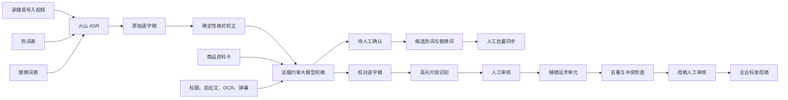

# 企业级直播校稿与话术资产设计

日期：2026-07-21  
项目：bili-shadowreplay  
状态：待用户最终审核

## 1. 目标

本系统将直播录播和导入视频转化为可追溯、可审核、可复用的话术资产。

系统的业务重点依次为：

1. 生成与原视频匹配度较高、保留时间戳的逐字稿。
2. 基于逐字稿和视频证据识别有业务价值的片段。
3. 将审核通过的片段提炼为带使用条件的辅稿话术单元。
4. 在后续阶段将辅稿经过人工审核、去重和冲突检查后加入企业母稿。

逐字稿是证据底稿，不是最终产品；片段分析与可复用话术资产才是核心产出。

## 2. 非目标

- 不要求逐字稿变成书面化文章。
- 不允许大模型为了通顺而改写主播原意。
- 不以情绪热闹、音量或单一关键词作为高光充分条件。
- 不允许大模型自动将辅稿写入企业母稿。
- 第一阶段不建设完整的母稿编辑器，只预留稳定的数据契约和准入状态。

## 3. 总体架构



三个模型职责必须隔离：

- 校稿模型只能提出文字修改，不能评价销售效果。
- 片段分析模型只能基于校对稿和证据判断片段，不得静默修改逐字稿。
- 话术提炼模型只能使用审核通过的片段和事实，不得自行补充商品信息。

## 4. 逐字稿双层输出

每个分析来源保存以下产物：

- `subtitle.raw.srt`：ASR 原稿，创建后不可覆盖。
- `subtitle.corrected.srt`：应用已通过修改后的校对稿。
- `subtitle.corrections.json`：模型建议、证据、置信度和差异。
- `subtitle.review.json`：人工确认、驳回、审核人、时间和同步状态。

旧项目中的 `subtitle.srt` 保持兼容：过渡期读取时优先使用校对稿，没有校对稿时读取旧字幕；写入时同时维护兼容文件，后续版本再迁移。

### 4.1 原稿规则

- 保留 ASR 返回的文字和时间戳。
- 不做语义润色。
- 不因大模型建议覆盖原稿。
- 原稿可在审核界面随时查看。

### 4.2 确定性格式校正

允许自动处理：

- 标点和多余空白。
- 大小写标准化。
- 已经存在于人工批准替换词表中的固定替换。
- 明确的型号与成色边界粘连，例如 `A4PRO299新` 候选拆分为 `A4PRO2 99新`。

涉及型号、价格、优惠、链接号、成色、库存、赠品和成交结论时，确定性规则只能提出候选修改，不能绕过事实审核。

## 5. 证据模型

证据可靠度从高到低排序：

1. 人工填写并确认的商品资料卡。
2. 企业商品库中的标准型号、价格和属性。
3. 视频画面 OCR，包括商品卡、价格牌和链接号。
4. 当前句前后 30 秒至 60 秒的逐字稿。
5. 直播标题、房间常用词和已批准词库。
6. 弹幕，仅可作为需求和互动线索。
7. 大模型自身知识，不能单独支持关键事实修改。

关键事实修改至少需要一条一级或二级证据，或者两条相互独立的较低级证据。证据冲突时保留原文并进入待回听队列。

## 6. 大模型校稿契约

校稿按 60 至 120 秒分块，相邻块保留 10 至 20 秒重叠。模型不能返回改写后的整篇全文，只能返回补丁列表。

```json
{
  "segment_id": 28,
  "original": "A4PRO299新的",
  "corrected": "A4PRO2 99新的",
  "changes": [
    {
      "from": "A4PRO299新",
      "to": "A4PRO2 99新",
      "type": "model_condition_boundary",
      "evidence_refs": ["fact-card:model:A4PRO2", "fact-card:condition:99新"],
      "confidence": 0.97,
      "critical_fact": true
    }
  ],
  "needs_review": true
}
```

程序在应用补丁前执行以下验证：

- `from` 必须精确存在于原片段。
- 修改不能改变时间戳和片段数量。
- 单个片段修改比例不得超过配置上限。
- 关键事实必须引用有效证据。
- 模型返回的证据标识必须能在本地证据包中解析。
- 验证失败时不修改字幕，只记录错误和待回听状态。

## 7. 审核分级

### 7.1 自动应用

- 标点、空格和大小写。
- 人工批准替换词表中的确定性替换。
- 不涉及关键事实且置信度达到配置阈值的格式修改。

### 7.2 必须人工确认

- 商品品牌和型号。
- 价格、优惠金额和优惠条件。
- 链接号和购买入口。
- 成色、库存、配件和赠品。
- 成交、下单、锁货和付款结论。
- 任何会进入辅稿或母稿的关键事实。

### 7.3 保留原文并回听

- 证据缺失或互相冲突。
- 模型置信度不足。
- 修改范围过大。
- 原音频不清晰。
- OCR、商品卡和主播原话无法对应。

## 8. 小白审核界面

界面沿用现有三栏结构：

- 左侧：视频、当前时间点和商品证据。
- 中间：逐字稿，自动定位当前问题并高亮差异。
- 右侧：识别原文、建议修改、修改原因和两个主要操作。

面向用户的术语必须简单：

- `ASR 原文` 显示为“识别出来的文字”。
- `corrected` 显示为“建议修改为”。
- `evidence` 显示为“为什么这样改”。
- `reject` 显示为“保留原文”。
- `approve` 显示为“采用修改”。
- `sync corpus` 显示为“加入常用词库”。

技术细节默认折叠。用户主要操作只有：播放回听、保留原文、采用修改、加入待同步列表。

## 9. 热词与替换词闭环

现有火山热词表和替换词表继续作为 ASR 第一层能力。系统新增本地候选队列，不直接自动污染远端词表。

候选状态：

- `pending`：等待人工判断是否进入词库。
- `approved`：已批准，等待批量同步。
- `rejected`：不进入词库。
- `synced`：已同步到远端表或导出文件。
- `sync_failed`：同步失败，可重试。

候选类型：

- 热词：正确词未被稳定识别，用于提升召回率。
- 替换词：已经确认的固定错误到标准词映射。
- 仅本地规则：格式边界，不适合成为远端语义替换。

批量同步前必须显示新增、修改和冲突列表，并再次要求人工确认。当前代码只传递火山表 ID；远端表管理通过独立适配器实现。若账号暂不支持管理 API，系统导出可导入的 JSON/CSV，不阻塞校稿流程。

## 10. 片段识别规则

片段分析必须回答：

- 主商品是什么。
- 用户需求或问题是什么。
- 主播使用了什么销售动作。
- 是否处理异议。
- 是否给出明确购买动作。
- 是否存在成交证据。
- 为什么值得保留。
- 哪些事实仍需确认。

片段分级：

- 核心高光：证据充分，具备明确业务价值，可申请生成辅稿。
- 候选高光：有价值但证据不足，需要人工判断。
- 普通片段：保留在逐字稿，不进入辅稿。
- 风险片段：错价、错链接、承诺不清或事实冲突。

“讲得热闹”、高音量、单一 CTA 或单一价格词不能独立构成核心高光。

## 11. 辅稿话术单元

辅稿不是复制整段逐字稿，而是结构化话术资产：

```json
{
  "asset_id": "script-unit-uuid",
  "source_id": "archive-or-video-id",
  "source_range": { "start": 120, "end": 142 },
  "category": "需求确认",
  "product_scope": ["运动相机"],
  "sales_stage": "异议处理",
  "raw_excerpt": "原始表达",
  "recommended_script": "推荐表达",
  "why_it_works": "有效原因",
  "preconditions": ["型号已确认", "成色已确认"],
  "prohibited_uses": ["不同型号", "成色未确认"],
  "fact_refs": ["fact-card:model:A4PRO2"],
  "review_status": "pending",
  "version": 1
}
```

每条辅稿必须保留来源视频、时间范围、事实引用、适用条件和禁用条件。

## 12. 母稿准入

任何辅稿进入母稿前必须人工审核，大模型无自动写入权限。

准入条件：

- 来源视频和时间点完整。
- 关键事实已确认。
- 片段分析已审核。
- 推荐话术没有增加无证据事实。
- 已标注商品范围和销售阶段。
- 已完成重复和冲突检查。
- 已记录审核人、审核时间和版本。

母稿变更必须创建新版本，支持查看差异和回退；不能覆盖历史版本。

## 13. 数据与审计

每次自动或人工操作记录：

- 来源 ID 和时间范围。
- 使用的 ASR、校稿模型和提示词版本。
- 原始值、建议值和最终值。
- 证据引用。
- 自动应用或人工操作类型。
- 操作人和时间。
- 远端词库同步结果。

日志不得记录 API Key、Access Token 或完整敏感配置。词库同步属于有外部影响的写操作，必须有明确确认和失败重试记录。

## 14. 失败处理

- ASR 失败：保留任务状态和错误，不进入片段分析。
- 校稿模型失败：保留原始字幕，允许继续人工查看，但标记“未经智能校对”。
- 证据解析失败：关键事实一律不自动修改。
- 片段分析失败：不影响逐字稿和已保存校稿结果。
- 词库同步失败：候选保持 `sync_failed`，不得伪装成成功。
- 母稿写入失败：辅稿保持已审核状态，母稿版本不变化。

## 15. 测试策略

### 单元测试

- 型号与成色粘连边界。
- 纯数字和价格不被误拆。
- 关键事实修改必须有证据。
- 补丁无法匹配原文时拒绝应用。
- 审核状态转换合法性。
- 词库候选去重和冲突检测。

### 集成测试

- 录播与导入视频共用同一校稿链路。
- 原稿、校对稿、修改记录和审核记录一致。
- 高光分析只读取明确版本的校对稿。
- 词库批量同步失败后可重试。
- 辅稿保留视频来源和时间点。

### 回归样本

建立脱敏的企业直播回归集，至少覆盖：

- 英文数字混合型号。
- 价格、成色和链接号连续出现。
- 同音商品名。
- 主播改口和自我纠正。
- 多商品快速切换。
- 噪声、抢话和低音量。

评估分别统计普通文字匹配率和关键事实准确率。关键事实准确率优先级高于全文表面流畅度。

## 16. 分阶段实施

### 第一阶段：逐字稿可信化

- 双层字幕存储。
- 确定性边界规则。
- 证据包和大模型补丁契约。
- 小白审核界面。
- 本地候选热词/替换词队列。

### 第二阶段：片段资产化

- 统一录播与导入视频分析入口。
- 核心高光、候选高光、普通和风险分级。
- 片段人工审核。
- 生成结构化辅稿话术单元。

### 第三阶段：企业母稿

- 辅稿检索、去重和冲突检测。
- 母稿人工准入。
- 版本、差异、回退和权限。
- 词库和话术效果的持续评估。

## 17. 验收标准

- 用户能够在同一页面播放视频、定位逐字稿并审核修改。
- 原稿永远可追溯，模型不能静默覆盖关键事实。
- 录播和导入视频使用同一数据契约。
- 所有关键事实修改必须人工确认。
- 已确认修改可以进入待同步词库，但不能自动写入远端。
- 高光片段必须附带证据、价值说明和待确认事项。
- 辅稿必须附带来源、适用条件和禁用条件。
- 未经人工审核的辅稿不能进入母稿。
