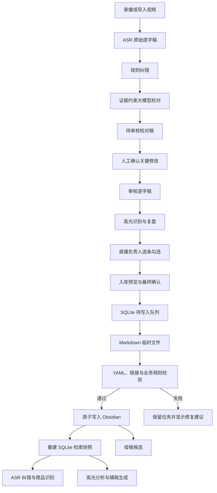

# Obsidian 受控知识库接入设计

日期：2026-07-22  
项目：bili-shadowreplay  
状态：已确认，待实施计划

## 1. 目标

把系统预校对、直播负责人审核、高光复盘和辅稿候选，以可审核、可追溯、可重建的方式沉淀到 Obsidian，并让后续 ASR 纠错、高光分析和母稿编排能够读取已审核知识。

首版服务于单个直播负责人。他可以完成整场复盘和逐条确认，但大模型无权自动把内容写入正式知识或企业母稿。

## 2. 非目标

- 不在首版建设完整母稿编辑器。
- 不自动发布视频或话术到外部平台。
- 不把 SQLite 作为知识真源。
- 不允许未审核的模型输出参与正式检索。
- 不在知识库中复制大体积视频文件。
- 不把历史价格、库存、赠品或链接号固化为长期产品事实。

## 3. 核心原则

1. Obsidian Markdown 是人工维护的唯一知识真源。
2. SQLite 只保存检索快照、审核状态、同步游标和待写入任务，可从 Obsidian 重建。
3. 写入必须经过逐条勾选和最终确认，不能在高光识别完成后自动发生。
4. 整场直播只保存一份审核逐字稿；案例、辅稿和证据卡引用对应时间段。
5. 原始逐字稿不可覆盖，校正稿按版本保存。
6. 人工修改优先于应用生成内容；发生冲突时不得静默覆盖。

## 4. 方案选择

采用“Obsidian 真源 + SQLite 索引 + 持久化待写入队列”的受控双向方案。

- 只读方案无法持续沉淀优秀直播经验。
- 数据库主导再导出会形成两套真源。
- 应用直接无状态写 Markdown 无法可靠处理重复入库、部分失败和人工冲突。

## 5. 总体架构



## 6. 模块边界

### 6.1 Transcript Pre-review Pipeline

在人工审核前先完成两层自动预校对：

1. 规则纠错：使用已审核热词、替换词、型号边界、数字与成色拆分、标点和重复字规则。
2. 证据约束校对：大模型只能依据产品资料、直播标题、相邻上下文、OCR 和其他已审核证据提出修改。

规则纠错和模型建议合并后形成“待审核校对稿”。商品、型号、价格、成色、库存、优惠和链接号等关键商业事实，只有满足封闭白名单规则时才可自动应用；其他修改必须由用户确认。全部关键项处理完成后，产物才升级为“审核逐字稿”并允许进入高光分析和知识入库。

### 6.2 Knowledge Vault Adapter

- 选择并验证 Obsidian Vault。
- 创建首版必需目录。
- 读取、解析和原子写入 Markdown。
- 不负责 AI 分析和业务审核。

### 6.3 Knowledge Card Builder

- 将审核逐字稿、高光候选和复盘结果转换为稳定卡片结构。
- 生成稳定 ID、内部链接和版本元数据。
- 不直接访问文件系统。

### 6.4 Knowledge Review Gate

- 检查逐字稿是否完成校正。
- 阻止包含未确认商品、价格、库存、链接等关键事实的内容入库。
- 只接受用户明确勾选的高光。

### 6.5 Knowledge Sync Index

- 将已审核 Markdown 建立为 SQLite 检索快照。
- 保存文件哈希、更新时间、解析状态和审核状态。
- Obsidian 文件删除或修改后可增量重建。

### 6.6 Knowledge Write Queue

- 在正式写盘前持久化写入任务。
- 记录每张卡的目标路径、内容哈希和执行结果。
- 支持失败重试和部分完成后的幂等恢复。

## 7. Obsidian 目录

沿用现有企业知识库样板：

```text
00-首页与说明/
01-产品事实/
02-别名与ASR纠错/
03-直播案例/
04-话术模块/
05-人群画像/
06-辅稿/
07-证据索引/
08-产品参数库/
09-审核逐字稿/
90-模板/
99-待处理冲突/
```

首版写入 `03-直播案例`、`06-辅稿`、`07-证据索引` 和 `09-审核逐字稿`。读取范围仅包含审核状态为“已审核”或“已入库”的卡片。

## 8. 卡片与稳定 ID

- `TR-YYYYMMDD-场次ID`：一场直播的一份审核逐字稿。
- `LC-商品键-YYYYMMDD-序号`：一条已确认高光对应的直播案例。
- `SS-商品键-序号`：可复用辅稿候选。
- `EI-商品键-序号`：证据索引。

ID 一经生成不可因标题修改而变化。再次提交相同来源和时间范围时更新既有卡片版本，不创建重复卡片。

每张卡至少包含：

- `id`、`title`、`type`、`status`、`version`。
- `source_kind`、`source_id`、`source_time_range`。
- `created_at`、`updated_at`、`reviewed_at`。
- `content_hash`、`reviewer`。
- 关联逐字稿、案例、辅稿和证据的 Obsidian 链接。

## 9. 审核状态

统一状态流转：

```text
草稿 -> 待确认 -> 已审核 -> 已入库 -> 已停用
```

- 模型只能创建“草稿”。
- 用户逐条勾选后进入“待确认”。
- 用户在入库预览中最终确认后进入“已审核”。
- Markdown 成功写入且重新读取校验通过后进入“已入库”。
- 失效知识保留历史文件并标记“已停用”，不直接删除。

## 10. 用户流程

### 10.1 设置页

1. 选择 Obsidian 知识库文件夹。
2. 系统检查 `.obsidian` 或现有 Markdown 结构，并显示将要创建的目录。
3. 用户确认后保存路径并执行首次同步。
4. 页面显示连接状态、最近同步时间、成功/跳过/冲突/失败数量。

### 10.2 分析页

1. 系统生成待审核校对稿，直播负责人处理关键修改并形成审核逐字稿。
2. 查看高光和复盘结果。
3. 逐条勾选要沉淀的片段。
4. 点击底部固定的“入库所选片段”。
5. 预览每条的“讲了什么、保留原因、可复用话术、适用条件、待确认项”。
6. 处理阻塞项并最终确认。
7. 写入后在片段上显示“已入库”，并可打开对应 Obsidian 卡片。

## 11. 入库规则

- 没有审核逐字稿时禁止入库。
- 商品、型号、价格、成色、库存、优惠和链接存在未确认项时禁止入库。
- 原话与分析分栏保存，分析不得覆盖原话。
- 辅稿必须包含适用条件、禁用条件和动态字段占位符。
- 动态商业信息只能留在案例证据中，不能晋级为长期产品事实。
- 正式母稿只接收“已入库”的辅稿候选，且仍需单独人工确认。

## 12. 一致性与冲突处理

写入流程：

1. 在 SQLite 创建待写入任务。
2. 为全部目标卡生成临时文件。
3. 校验 YAML、UTF-8、内部链接、稳定 ID 和业务准入规则。
4. 使用同目录临时文件加原子重命名完成单卡写入。
5. 重新读取并比较内容哈希。
6. 更新任务和索引状态。

如果 Obsidian 文件自上次同步后被人工修改：

- 不覆盖人工文件。
- 把应用版本写入 `99-待处理冲突`。
- 展示人工版与待写入版的差异。
- 用户选择保留人工版、采用应用版或手工合并。

## 13. 异常处理

- Vault 不存在：保留配置但标记断开，提示重新选择。
- Vault 无写权限：分析结果保留在待写入队列，不丢失。
- 单卡校验失败：其他卡可继续写入，失败卡保持待处理。
- 应用中途退出：下次启动恢复未完成任务并先做幂等检查。
- Markdown 无法解析：隔离该文件，不影响其余知识同步。
- 源视频缺失：已入库知识保留，证据卡标记“源视频不可用”。
- SQLite 损坏或清空：从 Obsidian 全量重建索引。

所有用户提示使用业务语言，不直接显示 Rust、SQLite 或文件系统底层对象。

## 14. 安全与审计

- 不向 Obsidian 写入 API Key、Cookie、账号令牌或买家个人信息。
- 文件路径必须限制在用户确认的 Vault 根目录内，防止路径穿越。
- 每次入库记录操作者、时间、来源、旧版本哈希和新版本哈希。
- 应用删除录像不删除知识卡；只更新证据可用状态。
- 知识卡默认本地保存，首版不自动上传云端。

## 15. 测试与验收

必须覆盖：

1. 首次连接空 Vault 和已有 Vault。
2. 整场审核逐字稿只生成一份。
3. 单条、多条高光勾选入库。
4. 未确认关键事实拦截。
5. 同一来源重复入库的幂等更新。
6. 写入中断后的任务恢复。
7. 人工修改 Markdown 后的冲突隔离。
8. SQLite 索引全量重建与增量同步。
9. 中文文件名、长标题和 Windows 路径。
10. 源视频缺失但知识卡仍可读取。
11. 未审核知识不能进入 ASR 与高光检索。
12. 所有 Obsidian 内部链接均可解析。

## 16. 分阶段实施

### P1：连接与只读同步

- Vault 选择、结构校验、状态展示。
- Markdown 解析和 SQLite 可重建索引。
- 已审核产品事实与 ASR 纠错规则进入检索。

### P2：逐条受控入库

- 审核逐字稿、案例、辅稿和证据卡构建。
- 逐条勾选、入库预览、准入检查和写入队列。
- 幂等写入、失败恢复和“打开 Obsidian 卡片”。

### P3：知识反哺分析

- 已审核知识参与 ASR 纠错、商品识别和高光分析。
- 显示模型引用了哪些知识卡。
- 未审核和已停用知识严格隔离。

### P4：母稿候选

- 辅稿去重、冲突检测和适用场景分类。
- 人工选择辅稿进入母稿候选。
- 母稿版本化、差异查看和回退另行设计。

## 17. 完成标准

- 直播负责人能从一场复盘中逐条选择并可靠写入 Obsidian。
- 写入失败或程序退出不会丢失待入库内容。
- 重复操作不会生成重复知识。
- 人工修改的 Markdown 不会被静默覆盖。
- SQLite 可以完全从 Obsidian 重建。
- 后续模型只能检索已审核知识，并能显示引用来源。
